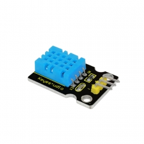
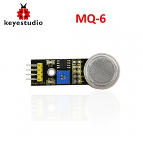
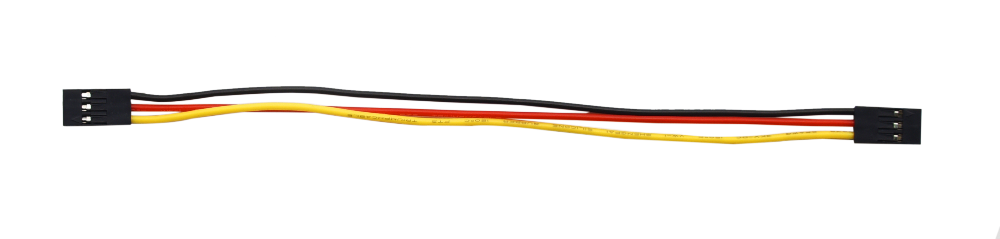
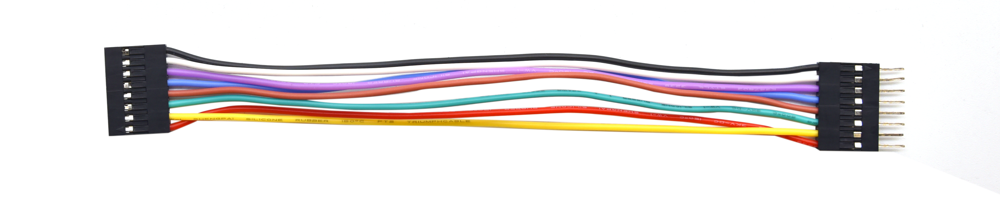

# KS0507 Keyestudio Smart Motorhome Kit

1\. Description：

When it comes to programming, many think it difficult. However, KEYES group
issues a smart motorhome kit to cope with this problem.

This is a low-cost, easy-to-build and open source programming kit.

In fact, it integrates a smart home and a robot car. You can absorb the

knowledge of programming like electronics, control logic, computing and

science from practical installation.

In compliance with the tutorial, you can create your own robot by boards, slot
connection and wiring.

It also has a temperature humidity sensor and an LCD display except LED, line
tracking sensor, ultrasonic sensor, Bluetooth module and motor driving modules.
Furthermore, the detailed projects will guide you to learn the working principle
of sensors and modules.

If interested in STEM and code programming, you can customize your

smart motorhome by altering code and adding extra modules.

That sounds entertaining, right? Let’s get started!

2\. Features：

Multi-purpose function：obstacle avoidance, line tracking, Bluetooth control,
ultrasonic follow, smart sensation and so on.

Easy to build：Slot connection and without soldering circuit

Novel style：Adopt strong wood board, acrylic board, RGB and lcd1602 modules.

High extension：configure motor driving chip, preserve IIC, UART and SPI port
and expand other sensor and module.

Basic programming learning：use C language and code

3\. Specification：

Working voltage: 5v

Input voltage: 7-12V

Maximum output current: 3A

Maximum power dissipation: 15W

Motor speed: 200 rpm (4.5V)

Motor driving form: TB6612 chip drive

Ultrasonic sensing angle: \<15 degrees

Ultrasonic detection distance: 2cm-400cm

Bluetooth remote control distance: 50 meters (measured)

Bluetooth APP control: support Android and iOS system

4\. Kit：

Remember to check if the components received are in line with the following
product list when you getting this kit.

| \# | Picture| Model| QTY |
|----|------------------------------------------------|-------------------------------------------------------------|-----|
| 1  | | Keyestudio MEGA 2560 Smart Development Board                | 1   |
| 2  | | 9 Pcs Wooden Boards                                         | 1   |
| 3  | | Acrylic Board O                                             | 1   |
| 4  | | Acrylic Board P                                             | 1   |
| 5  | | Keyestudio 9G 180°Servo                                     | 3   |
| 6  | | 6-Slot AA Battery Holder| 1   |
| 7  | | 4\*4 Matrix Array Membrane Keypad                           | 1   |
| 8  | | Keyestudio I2C1602 LCD Display Module                       | 1   |
| 9  | | HC-SR04 Ultrasonic Sensor                                   | 1   |
| 10 | | Keyestudio Quick Connectors Line Tracking Sensor            | 1   |
| 11 | | Keyestudio TEMT6000 Ambient Light Sensor                    | 1   |
| 12 | | Keyestudio Steam Sensor                                     | 1   |
| 13 | | Keyestudio DHT11 Temperature and Humidity Sensor            | 1   |
| 14 | | Keyestudio Analog Gas Sensor                                | 1   |
| 15 | | Keyestudio Power Amplifier Module                           | 1   |
| 16 | | Keyestudio PIR Motion Sensor                                | 1   |
| 17 | | Keyestudio Full Color LED                                   | 2   |
| 18 | | Keyestudio HM-10 Bluetooth Module                           | 1   |
| 19 | | Keyestudio Digital Push Button                              | 1   |
| 20 | | M3\*8MM Round Head Screws                                   | 32  |
| 27 | | M3\*10MM Round Head Screws                                  | 6   |
| 28 | | M3\*12MM Round Head Screws                                  | 5   |
| 29 | | M3\*20MM Round Head Screws                                  | 2   |
| 30 | | M3\*30MM Round Head Screws                                  | 10  |
| 31 | | M3 Nickel Plated Nuts                                       | 35  |
| 32 | | M3 Self-locking Nuts                                        | 6   |
| 33 | | M2\*10MM Round Head Screws                                  | 3   |
| 34 | | M2\*16MM Round Head Screws                                  | 5   |
| 35 | | M2 Nickel Plated Nuts                                       | 8   |
| 36 | | M1.4\*8MM Round Head Screws                                 | 6   |
| 37 | | M1.4 Nickel Plated Nuts                                     | 6   |
| 38 | | M1.2\*4MM Round Head Self-tapping Screws                    | 14  |
| 39 | | M3\*12MM Flat Head Screws                                   | 3   |
| 40 | | M3\*10MM Copper Pillar                                      | 3   |
| 41 | | M3\*20MM Copper Pillar                                      | 3   |
| 42 | | 3.0\*40MM Screwdriver                                       | 1   |
| 43 | | 2.0\*40MM Screwdriver                                       | 1   |
| 43 | | Cross Wrench                                                | 1   |
| 44 | | AM/BM USB Cable                                             | 1   |
| 45 | | Winding Pipe                                                | 1   |
| 46 | | 3\*100MM Black Ties                                         | 4   |
| 47 || Full Color WS2812B LED Light Strip with 5V 5050 Light Beads | 2   |
| 48 | | 15cm 3pin F-F 26AWG Dupont Line| 2   |
| 49 | | 20cm 3pin F-F 26AWG Dupont Line| 6   |
| 50 |  | 15cm 8pin M-F 26AWG Dupont Line| 1   |
| 51 | | 35cm 4pin F-F 26AWG Dupont Line                             | 2   |
| 52 || 35cm 4pin F-F 26AWG Dupont Line                             | 1   |
| 53 || 20cm 4pin F-F 26AWG Dupont Line                             | 2   |
| 54 || 40cm 5pin XH2.54 to PH2.0 26AWG Dupont Line                 | 1   |
| 55 || 15cm 3pin F-F 26AWG Dupont Line                             | 2   |
| 56 || 50\*82\*0.2MM Plastic Bag                                   | 15  |
| 57 || 63\*106\*0.2MM Plastic Bag                                  | 1   |
| 58 | | 4\*6CM Plastic Bag                                          | 17  |
| 59 | | 6\*9CM Plastic Bag                                          | 2   |
| 60 | | 10\*15CM Plastic Bag                                        | 2   |

5\. Getting Started with Arduino

Installing Arduino IDE

When we get control board, we need to download Arduino IDE and driver firstly.

You could download Arduino IDE from the official website:

<https://www.arduino.cc/>, click the SOFTWARE on the browse bar,
click“DOWNLOADS” to enter download page, as shown below:

You can download either Windows win7 and newer or Windows ZIP file.

The first one doesn’t require

There are two versions of IDE for WINDOWS system, you can choose from the
Installer (.exe) and the Zip packages. We suggest you use the first one that
installs directly everything you need to use the Arduino Software (IDE),
including the drivers.

With the Zip package you need to install the drivers manually. The Zip file is
also useful if you want to create a portable installation.

You just need to click JUST DOWNLOAD.

Keyestudio MEGA 2560 Smart Development Board

We need to know keyestudio MEGA 2560 development board, as a core of this smart
car.

The processor core of MEGA 2560 board is ATMEGA2560-16AU, with the cp2102 chip.

It has 54 digital input/output pins (of which 15 can be used as PWM outputs), 16
analog inputs, 4 UARTs (hardware serial ports), a 16 MHz crystal oscillator, a
USB connection, a power jack, 1 ICSP header, and a reset button.

It can be interfaced computer with external power with a USB cable.

| Microcontroller         | ATMEGA2560-16AU                                                                                                                        |
|-------------------------|----------------------------------------------------------------------------------------------------------------------------------------|
| Working Voltage         | 5V                                                                                                                                     |
| Input Voltage           | DC7-12V                                                                                                                                |
| Digital I/O Pins        | 54个 (D0-D53)  (pin D9,D10,D11 and D12 control speed of motor，D28,D29,D30,D31,D32,D33,D34 and D35 control rotation direction of motor |
| PWM IO Pins             | 15 (D2-D13, D44-D46)                                                                                                                   |
| Analog Input Pins       | 16 (A0-A15)                                                                                                                            |
| DC Current per I/O Pin  | 20 mA                                                                                                                                  |
| DC Current for 3.3V Pin | 50 mA                                                                                                                                  |
| Flash Memory            | 256 KB (ATMEGA2560-16AU) of which 8 KB used by boot loader                                                                             |
| SRAM                    | 8 KB (ATMEGA2560-16AU)                                                                                                                 |
| EEPROM                  | 4 KB (ATMEGA2560-16AU)                                                                                                                 |
| Clock Speed             | 16 MHz                                                                                                                                 |

Install Driver on Windows System

Let’s install the driver of keyestudio MEGA 2560 smart development board. The
USB-TTL chip on this board adopts CP2102 serial chip. The driver program of this
chip is included in Arduino 1.8 version and above, which is convenient. Plugged
in USB port, the computer can recognize the hardware and automatically install
the driver of CP2102.

If install unsuccessfully, or you intend to install manually, open the device
manager of computer. Right click Computer----- Properties----- Device Manager.

There is a yellow exclamation mark on the page, which implies installing
unsuccessfully. Then we double click the hardware and update the driver.

Click“OK”to enter the following page, click“browse my computer for updated
driver software”, find out the installed or downloaded ARDUINO software. As
shown below:

There is a DRIVERS folder in Arduino software installed package. Just open
driver folder and you can see the driver of CP210X series chips.

We click“Browse”, then find out the driver folder, or you could enter “driver”
to search in rectangular box, then click“next”, the driver will be installed
successfully. (I place Arduino software folder on the desktop, you can follow my
way)

Open device manager, we will find the yellow exclamation mark disappear. The
driver of CP2102 is installed successfully.

Install Driver on MAC System

The USB to serial chip of control board is CP2102. We install driver on MAC as
follows:
<https://wiki.keyestudio.com/How_to_Install_the_Driver_of_CP2102_on_MAC_System>

Arduino IDE Setting

Clickicon，open Arduino IDE.

To avoid the errors when uploading the program to the board, you need to select
the correct Arduino board that matches the board connected to your computer.

Then come back to the Arduino software, you should click Tools→Board, select the
board. (as shown below)

Then select the correct COM port (you can see the corresponding COM port after
the driver is successfully installed)

Before uploading the program to the board, let’s demonstrate the function of
each symbol in the Arduino IDE toolbar.

A- Used to verify whether there is any compiling mistakes or not.

B- Used to upload the sketch to your Arduino board.

C- Used to create shortcut window of a new sketch.

D- Used to directly open an example sketch.

E- Used to save the sketch.

F- Used to send the serial data received from board to the serial monitor.

Note: the setting method on Mac system is same as on Windows system except
different COM port, as shown below:

Start First Program

We’ve known how to download and install the driver of development board , next,
we will burn a code to show“Hello World！”in the monitor.

Test Code

void setup() {

// initialize serial communication at 9600 bits per second:

Serial.begin(9600);

}

void loop() {

// print out "Hello world!"

Serial.println("Hello world!");

delay(1000);// delay 1 second

}

Open Arduino IDE, and set board as follows:

Set COM port, as shown below:

Clickto start compiling the program, and check errors.

Clickto upload the program, upload successfully.

Upload the program successfully, open serial monitor and set baud rate to 9600.
Monitor will print“Hello World!”each 1s.

Congratulation, you finish the first program.

Projects

The whole project begins with basic program. Starting from simple to complex,
the lessons will guide you to assemble smart motorhome and absorb the knowledge
of electronic and machinery step by step. I reckon that you might hardly sit
still and itch to have a go, let’s get started.

Note: (G), marked on each sensor and module, is negative pole and connected
to“G”,“-”or“GND”on the sensor shield or control board ; (V) is positive pole and
interfaced with“V”,“VCC”,“+”or“5V”on the sensor shield or control board.

Project 1: LED Blink

Description：

For the starter and enthusiast, this is a fundamental program---LED Blink.

LED, the abbreviation of light emitting diodes, consist of Ga, As, P, N chemical
compound and so on. It is often applied to numbers and text display as an
indicator in the circuit.

The LED can flash diverse color by altering the delay time in the test code.
When in control, power on GND and VCC, the LED will be on if S end is high
level; nevertheless, it will go off.

(2) Parameter：

Control interface: digital port

Working voltage: DC 3.3-5V

Pin spacing: 2.54mm

LED display color: red

(3) Component：

| Keyestudio MEGA 2560 Smart Development Board\*1 | Keyestudio White LED Module\*1| 3pin F-F 26AWG Dupont Line|
|-------------------------------------------------|-------------------------------|---------------------------|
|                                                 ||  |
| USB Cable\*1                                    | 6-Slot AA Battery Holder||
|                                                 |  ||

Connection Diagram：

From the above diagram, pin -, + and S of LED module are respectively connected
to pin G, 5V and D13 of expansion board. Then we compile the code as follows:

Test Code：

/\*

keyestudio smart motorhome

lesson 1.1

Blink

http://www.keyestudio.com

\*/

\#define LED 13 //define the pin of LED as D13

void setup()

{

pinMode(LED, OUTPUT);// initialize digital pin LED as an output.

}

void loop() // the loop function runs over and over again forever

{

digitalWrite(LED, HIGH); // turn the LED on (HIGH is the voltage level

delay(1000); // wait for a second

digitalWrite(LED, LOW); // turn the LED off by making the voltage LOW

delay(1000); // wait for a second

}

//\*\*\*\*\*\*\*\*\*\*\*\*\*\*\*\*\*\*\*\*\*\*\*\*\*\*\*\*\*\*\*\*\*\*\*\*\*\*\*\*\*\*\*\*\*\*\*\*\*\*\*\*\*\*\*\*\*\*\*\*\*\*\*\*\*\*\*

Test Result：

Upload the program, LED blinks with the interval of 1s.

Code Explanation:

pinMode(LED，OUTPUT) - This function can denote that the pin is INPUT or OUTPUT.

digitalWrite(LED，HIGH) - When pin is OUTPUT, we can set it to HIGH(output 5V)
or LOW(output 0V).

Extension Practice：

The LED flashes for 1s through the test result, therefore, pins and delay time
affect flash frequency.

/\*

keyestudio smart motorhome

lesson 1.2

Blink

http://www.keyestudio.com

\*/

\#define LED 13 //Define the pin of LED as D13

void setup()

{

pinMode(LED, OUTPUT);// initialize digital pin LED as an output.

}

void loop() // the loop function runs over and over again forever

{

digitalWrite(LED, HIGH); // turn LED on (HIGH is the voltage level

delay(100); // wait for a second

digitalWrite(LED, LOW); // turn LED off by making the voltage LOW

delay(100); // wait for a second

}

//\*\*\*\*\*\*\*\*\*\*\*\*\*\*\*\*\*\*\*\*\*\*\*\*\*\*\*\*\*\*\*\*\*\*\*\*\*\*\*\*\*\*\*\*\*\*\*\*\*\*\*\*\*\*\*\*\*\*\*\*\*\*\*\*

The LED flashes faster through the lesson 1.2 test.

Project 2: Adjust LED Brightness

Description：

In previous lesson, we control LED on and off and make it blink.

In this project, we will control LED brightness through PWM to simulate
breathing effect. Similarly, you can change the step length and delay time in
the code so as to demonstrate different breathing effect.

PWM is a means of controlling the analog output via digital means. Digital
control is used to generate square waves with different duty cycles (a signal
that constantly switches between high and low levels) to control the analog
output.In general, the input voltage of port are 0V and 5V. What if the 3V is
required? Or what if switch among 1V, 3V and 3.5V? We can’t change resistor
constantly. For this situation, we need to control by PWM.

For the Arduino digital port voltage output, there are only LOW and HIGH, which
correspond to the voltage output of 0V and 5V. You can define LOW as 0 and HIGH
as 1, and let the Arduino output five hundred 0 or 1 signals within 1 second.

If output five hundred 1, that is 5V; if all of which is 1, that is 0V. If
output 010101010101 in this way then the output port is 2.5V, which is like
showing movie. The movie we watch are not completely continuous. It actually
outputs 25 pictures per second. In this case, the human can’t tell it, neither
does PWM. If want different voltage, need to control the ratio of 0 and 1. The
more 0,1 signals output per unit time, the more accurately control.

Component：

| Keyestudio MEGA 2560 Smart Development Board\*1 | Keyestudio White LED Module\*1| 3pin F-F 26AWG Dupont Line|
|-------------------------------------------------|-------------------------------|---------------------------|
|||  |
| USB Cable\*1| 6-Slot AA Battery Holder||
|                                                 |  ||

Connection Diagram：

We keep connection diagram unchanged.

Test Code：

/\*

keyestudio smart motorhome

lesson 2.1

PWM

http://www.keyestudio.com

\*/

\#define LED 13 //Define the pin of LED as D13

int value;

void setup()

{

pinMode(LED, OUTPUT);// initialize digital pin LED as an output.

}

void loop () {

for (value = 0; value \< 255; value = value + 1) {

analogWrite (LED, value); // LED lights gradually light up

delay (5); // delay 5MS

}

for (value = 255; value \> 0; value = value - 1) {

analogWrite (LED, value); // LED gradually goes out

delay (5); // delay 5MS

}

}

(5) Test Result：

Upload test code successfully, LED gradually becomes brighter then darker, like
human breath.

(6) Code Explanation

When we need to repeat some statements, we could use FOR statement.

FOR statement format is shown below:

FOR cyclic sequence:

Round 1：1 → 2 → 3 → 4

Round 2：2 → 3 → 4

…

Until number 2 is not established, “for”loop is over,

After knowing this order, go back to code:

for (int value = 0; value \< 255; value=value+1){

...}

for (int value = 255; value \>0; value=value-1){

...}

The two“for”statements make value increase from 0 to 255, then reduce from 255
to 0, then increase to 255,....infinitely loop

There is a new function in the following ----- analogWrite()

We know that digital port only has two state of 0 and 1. So how to send an
analog value to a digital value? Here,this function is needed. Let’s observe the
Arduino board and find 6 pins marked“\~”which can output PWM signals.

Function format as follows:

analogWrite(pin,value)

analogWrite() is used to write an analog value from 0\~255 for PWM port, so the
value is in the range of 0\~255. Attention that you only write the digital pins
with PWM function, such as pin 3, 5, 6, 9, 10, 11.

PWM is a technology to obtain analog quantity through digital method. Digital
control forms a square wave, and the square wave signal only has two states of
turning on and off (that is, high or low levels). By controlling the ratio of
the duration of turning on and off, a voltage varying from 0 to 5V can be
simulated. The time turning on(academically referred to as high level) is called
pulse width, so PWM is also called pulse width modulation.

Through the following five square waves, let’s acknowledge more about PWM.

In the above figure, the green line represents a period, and value of
analogWrite() corresponds to a percentage which is called Duty Cycle as well.
Duty cycle implies that high-level duration is divided by low-level duration in
a cycle. From top to bottom, the duty cycle of first square wave is 0% and its
corresponding value is 0. The LED brightness is lowest, that is, turn off. The
more time high level lasts, the brighter the LED. Therefore, the last duty cycle
is 100%, which correspond to 255, LED is brightest. 25% means darker.

PWM mostly is used for adjusting the LED brightness or rotation speed of motor.

It plays vital role in controlling smart robot car. I believe that you can’t
wait to enter next project.

(7) Extension Practice：

Let’s keep pins unchanged and change the delay value, then observe how LED
changes.

/\*

keyestudio smart motorhome

lesson 2.2

PWM

http://www.keyestudio.com

\*/

\#define LED 13 //Define the pin of LED as D13

int value;

void setup()

{

pinMode(LED, OUTPUT);// initialize digital pin LED as an output.

}

void loop () {

for (value = 0; value \< 255; value = value + 1) {

analogWrite (LED, value); // LED lights gradually light up

delay (20); // delay 30MS

}

for (value = 255; value \> 0; value = value - 1) {

analogWrite (LED, value); // LED gradually goes out

delay (20); // delay 30MS

}

}

//\*\*\*\*\*\*\*\*\*\*\*\*\*\*\*\*\*\*\*\*\*\*\*\*\*\*\*\*\*\*\*\*\*\*\*\*\*\*\*\*\*\*\*\*\*\*\*\*\*\*\*\*\*\*\*\*\*\*

Upload code to development board, the LED’s blink frequency is slower, isn’t it?

Project 3: Button Module

Description：

In this project, we control LED brightness by button module. The low level(0) is
output when the button is pressed; however, high level(1) is output when button
is released.

Specification：

Operating Voltage: 3.3-5V (DC)

Control Signal: Digital signal

Detection Height: 0-3 cm

Weight: 3.8g

Dimension: 34\*22\*15mm

Component：

| Keyestudio MEGA 2560 Smart Development Board\*1                                                                                                                 | Keyestudio Digital Button Module\*1 | Keyestudio White  LED Module\*1                                                                                                 |
|-----------------------------------------------------------------------------------------------------------------------------------------------------------------|-------------------------------------|---------------------------------------------------------------------------------------------------------------------------------|
|                                                                                                                                                                 |                                     |                                                                                                                                 |
| 3pin F-F 26AWG Dupont  Line \*2                                                                                                                                 | USB Cable\*1                        | 6-Slot AA Battery Holder                                                                                                        |
|  |

Connection Diagram：

Note: the pin G, V and S of button sensor are interfaced with pin G, V and D2 of
expansion board, and connect pin G, V and S of LED module to G, V and D13 of
expansion board.

Test Code：read the signal of button sensor

/\*

keyestudio smart motorhome

lesson 3.1

button

http://www.keyestudio.com

\*/

\#define button 2 //Define the pin of LED as D12

volatile int buttonState; //The output level state of button module

void setup()

{

Serial.begin(9600);//set baud rate to 9600

pinMode(button, INPUT);// initialize digital pin button as an input.

}

void loop () {

buttonState = digitalRead(button);

Serial.println(buttonState); //auto wrap and output the digital signals from
digital 2

delay(100);//delay in 100ms

}

Test Result：

Upload code, open serial monitor to set baud rate to 9600. The number “1”shows
up then“0”appears on the monitor.

Code Explanation:

Serial.begin(9600)- Initialize serial port, set baud rate to 9600

pinMode(pin, INPUT)-This function can denote that the pin is INPUT or OUTPUT

digitalRead(pin)-Read the state of pin, which are generally HIGH and LOW level.
Function digitalRead() will come back to HIGH or LOW level if pins are not
connected.

(8) Extension Practice：button-controlled LED

/\*

keyestudio smart motorhome

lesson 3.2

button

http://www.keyestudio.com

\*/

\#define LED 13 //Define the pin of LED as D13

\#define button 2 //Define the pin of button module as D2

volatile int buttonState; //the state of button

void setup()

{

Serial.begin(9600); //set baud rate to 9600

pinMode(button, INPUT); // initialize digital pin button as an input.

pinMode(LED, OUTPUT); // initialize digital pin LED as an output.

}

void loop ()

{

buttonState = digitalRead(button); //read the status of button

if (buttonState == 0) //if the button is pressed

{

digitalWrite(LED, HIGH); //Turn on LED

}

else

{

digitalWrite(LED, LOW); //turn off LED

}

delay(100); //dealy in 100ms

}

It turns out that LED is on when the button is pressed, and LED off when button
is released.

Project 4: Line Tracking Sensor

Description：

The tracking sensor is actually an infrared sensor. The component used here is
the TCRT5000 infrared tube.

Its working principle is to use the different reflectivity of infrared light to
the color, then convert the strength of the reflected signal into a current
signal.

During the process of detection, black is active at HIGH level, but white is
active at LOW level. The detection height is 0-3 cm.

Keyestudio 3-channel line tracking module has integrated 3 sets of TCRT5000
infrared tube on a single board, which is more convenient for wiring and
control.

By rotating the adjustable potentiometer on the sensor, it can adjust the
detection sensitivity of the sensor.

(2) Specification：

Operating Voltage: 3.3-5V (DC)

Interface: 5PIN

Output Signal: Digital signal

Detection Height: 0-3 cm

Note: Adjust the sensitivity by rotating the potentiometer before the test. The
sensitivity is best when LED is at on and off state.

(3) Component：

| Keyestudio MEGA 2560 Smart Development Board\*1|  Line Tracking Sensor\*1| Keyestudio White LED Module\*1 |
|------------------------------------------------|-------------------------|--------------------------------|
||                                   |                                |
| 3pin F-F 26AWG Dupont Line|  5pin XH2.54 to PH2.0 Dupont Line | USB Cable\*1                   |
|  |                                   |                                |
| 6-Slot AA Battery Holder                                                                                                                                        |||
|                                  |                                   |                                |

Connection Diagram：

Test Code：

/\*

keyestudio smart motorhome

lesson 4.1

Line Track sensor

http://www.keyestudio.com

\*/

//Line Tracking Sensor

\#define L_pin 50

\#define M_pin 51

\#define R_pin 52

void setup()

{

Serial.begin(9600); //Set baud rate to 9600

pinMode(L_pin, INPUT); //set pins of line tracking sensor to INPUT

pinMode(M_pin, INPUT);

pinMode(R_pin, INPUT);

}

void loop ()

{

int L_val = digitalRead(L_pin); //read the value of left sensor

int M_val = digitalRead(M_pin); //read the value of middle sensor

int R_val = digitalRead(R_pin); //read the value of right sensor

Serial.print(L_val);

Serial.print(" ");

Serial.print(M_val);

Serial.print(" ");

Serial.print(R_val);

Serial.println(" ");

delay(100); //delay in 100ms

}//\*\*\*\*\*\*\*\*\*\*\*\*\*\*\*\*\*\*\*\*\*\*\*\*\*\*\*\*\*\*\*\*\*\*\*\*\*\*\*\*\*\*\*\*\*\*\*\*\*\*\*\*\*\*\*\*\*\*\*\*\*\*\*\*\*\*\*\*\*\*\*\*\*\*\*\*

Test Result：

Upload code to development board, open serial monitor to check the state of
three line tracking sensors. When no signals are received, they are in high
level state and“1”shows up ; however, 1 changes into 0 when covering sensor with
white paper.

(7) Code Explanation:

Serial.begin(9600)-initialize the serial port, set serial baud rate to 9600

pinMode- define the PIN state(input and output) of MCU

digitalRead- read the level status of pin(HIGH, LOW)

Extension Practice：

We’ve known how line tracking sensor works, next, we connect an LED at pin 13.
We will control LED on and off by line tracking sensor, as shown below

Test Code

/\*

keyestudio smart motorhome

lesson 4.2

Line Track sensor

http://www.keyestudio.com

\*/

//LED pin

\#define LED 13

//Line Tracking Sensor

\#define L_pin 50

\#define M_pin 51

\#define R_pin 52

void setup()

{

Serial.begin(9600); //set baud rate to 9600

pinMode(LED, OUTPUT); //set LED to OUTPUT

pinMode(L_pin, INPUT); //set the pin of line tracking sensor to INPUT

pinMode(M_pin, INPUT);

pinMode(R_pin, INPUT);

}

void loop ()

{

int L_val = digitalRead(L_pin); //read the value of left sensor

int M_val = digitalRead(M_pin); //read the value of middle sensor

int R_val = digitalRead(R_pin); //read the value of right sensor

Serial.print(L_val);

Serial.print(" ");

Serial.print(M_val);

Serial.print(" ");

Serial.print(R_val);

Serial.println(" ");

delay(100); //delay in 100ms

if (L_val == 0 \|\| M_val == 0 \|\| R_val == 0) {

digitalWrite(LED, HIGH);

}

else {

digitalWrite(LED, LOW);

}

}

//\*\*\*\*\*\*\*\*\*\*\*\*\*\*\*\*\*\*\*\*\*\*\*\*\*\*\*\*\*\*\*\*\*\*\*\*\*\*\*\*\*\*\*\*\*\*\*\*\*\*\*\*\*\*\*\*\*\*\*\*\*\*\*\*\*\*\*\*\*\*\*\*\*\*\*\*

Upload the code to development board, we observe LED get brighter when covering
the line tracking sensor by hand.

Project 5: PIR Motion Sensor

Description：

The Pyroelectric infrared motion sensor can detect infrared signals from a
moving person or animal, and output switching signals. It can be applied to a
variety of occasions to detect the movement of human body. Conventional
pyroelectric infrared sensors are much more bigger, with complex circuit and
lower reliability. Now we launch this new pyroelectric infrared motion sensor,
specially designed for ARDUINO. This sensor integrates a digital pyroelectric
infrared sensor and connecting pins. It features higher sensibility and
reliability, lower power consumption, light weight, small size, lower voltage
working mode and simpler peripheral circuit.

Specification：

Input voltage: DC 3.3V \~ 5V

Working current: 15uA

Working temperature: -20 \~ 85 degrees Celsius

Output voltage: high 3 V, low 0 V

Output delay time (high level): about 2.3 to 3 seconds

Detection angle: about 100 °

Detection distance: 3-4 meters

Output indicator LED (high-level )

Pin limit current: 100mA

Note：

1\. The maximum distance is 3-4 meters during testing.

2\. When testing, firstly open the white lens, you can see the rectangular
sensing part. When the long line of the rectangular sensing part is parallel to
the ground, the distance is the best.

3\. When testing, need to cover the sensor with white lens, otherwise it will
affect the distance.

4\. The distance is best at 25℃, and the detection distance is shortened when it
exceeds 30℃.

5\. Done powering up and uploading the code, you need to wait 5-10 seconds then
start testing, otherwise it is not sensitive.

Component：

| Keyestudio MEGA 2560 Smart Development Board\*1| Keyestudio PIR  Motion Sensor\*1 | Keyestudio White LED Module\*1|
|------------------------------------------------|----------------------------------|-------------------------------|
||                                  |                                                                                                                                 |
| 3pin F-F 26AWG  Dupont Line\*2| USB Cable\*1| 6-Slot AA Battery Holder|
|  |

Connection Diagram

Note: on expansion board, the pin G, V and S of PIR motion sensor are connected
to G, V and 47; pin G, V and S of LED module are connected to G, V and 13.

Test Code：

/\*

keyestudio smart motorhome

lesson 5.1

PIR

http://www.keyestudio.com

\*/

//PIR Motion Sensor

\#define PIR 47 //PIR pin to D47

void setup()

{

Serial.begin(9600); //set baud rate to 9600

pinMode(PIR, INPUT); //set the pin of PIR motion sensor to INPUT

}

void loop ()

{

int val = digitalRead(PIR); //set the variable val to the value read

Serial.println(val);

delay(100); //delay in 100ms

}

Test Result：

Upload code, open serial monitor and set baud rate to 9600. The serial monitor
will show“1”when PIR motion sensor detects people around; on the contrary,
number“0”will appear on the monitor when nobody is detected.

Project Extension：

/\*

keyestudio smart motorhome

lesson 5.2

PIR

http://www.keyestudio.com

\*/

//PIR Motion Sensor

\#define PIR 47 //PIR pin to D47

\#define LED 13 //LED pin to D13

void setup()

{

pinMode(LED, OUTPUT); //set LED to OUTPUT

pinMode(PIR, INPUT); //set PIR motion sensor to INPUT

}

void loop ()

{

int val = digitalRead(PIR); //set val to the value read by sensor

if (val == 1) { //People is detected

digitalWrite(LED, HIGH); //turn on LED

}

else {

digitalWrite(LED, LOW); //otherwise, lED will be off

}

}

The LED connected to digital 13 will be on when the sensor detects people
moving, otherwise, LED will be off.

Project 6: 4\*4 Membrane Keypad

Description：

To save I/O ports of MCU, we make a Membrane Keypad. In this project, we will
make an experiment; serial monitor will display the corresponding character when
the membrane keypad is pressed.

Schematic Diagram:

Specification：

Working Voltage: 3.3V\~5V

Port：digital port

Component：

| Keyestudio MEGA 2560 Smart Development Board\*1 | Keyestudio 4\*4Membrane Keypad\*1| 8pin M-F 26AWG Dupont Line \*1|
|-------------------------------------------------|----------------------------------|-------------------------------|
|                                                 ||  |
| USB Cable\*1                                    | 6-Slot AA Battery Holder||
|                                                 |  ||

Connection Diagram：

Test Code：

/\*

keyestudio smart motorhome

lesson 6.1

Keypad

<http://www.keyestudio.com>

\*/

\#include \<Keypad.h\>

const byte ROWS = 4; //four rows

const byte COLS = 4; //four columns

char keypressed;

//define the cymbols on the buttons of the keypads

char keyMap[ROWS][COLS] = {

{'1', '2', '3', 'A'},

{'4', '5', '6', 'B'},

{'7', '8', '9', 'C'},

{'\*', '0', '\#', 'D'}

};

byte rowPins[ROWS] = {14, 15, 16, 17}; //Row pinouts of the keypad

byte colPins[COLS] = {36, 37, 38, 39}; //Column pinouts of the keypad

Keypad myKeypad = Keypad( makeKeymap(keyMap), rowPins, colPins, ROWS, COLS);

void setup()

{

Serial.begin(9600); //set baud rate to 9600

}

void loop ()

{

keypressed = myKeypad.getKey(); //read key value

if (keypressed != NO_KEY) { //read key value

Serial.print("key:");

Serial.println(keypressed); //print key value

}

}

Test Result：

Download code, open serial monitor and set baud rate to 9600. The serial monitor
will show the corresponding key value when the key of membrane keypad is
pressed, as shown below;

Project 7: Power Amplifier Module

Description：

We can use Arduino to make many interactive works of which the most commonly
used is acoustic-optic display.

All the previous experiment has something to do with LED. However, the
experiment of this chapter is related to produce sound. Normally, the experiment
is done with a buzzer or a speaker.

In this lesson, we will replace buzzer with power amplifier module, input
different frequencies square wave to emit different sound like“do re mi fa so la
si do”.

(2) Specification：

Control interface: digital port

Working voltage: DC 3.3-5V

(3) Component：

| Keyestudio MEGA 2560 Smart Development Board\*1 | Keyestudio Power Amplifier Module\*1| 3pin F-F 26AWG Dupont Line|
|-------------------------------------------------|-------------------------------------|---------------------------|
|||  |
| USB Cable\*1                                    | 6-Slot AA Battery Holder||
|                                                 |  |                                                                                                                                                                 |

(4) Connection Diagram：

Note: the pin G, V and S of passive buzzer are connected to pin G, V and D49 of
expansion board

Test Code：

//\*\*\*\*\*\*\*\*\*\*\*\*\*\*\*\*\*\*\*\*\*\*\*\*\*\*\*\*\*\*\*\*\*\*\*\*\*\*\*\*\*\*\*\*\*\*\*\*\*\*\*\*\*\*\*\*\*\*\*\*\*\*\*\*\*\*\*\*\*\*\*\*\*

/\*

keyestudio smart car

lesson 7.1

buzzer

http://www.keyestudio.com

\*/

\#define buzzer 49 //buzzer pin to D49

void setup() {

pinMode(buzzer, OUTPUT);//set digital 49 to OUTPUT

}

void loop () {

tone(buzzer, 262); //buzzer emits the sound with 262Hz

delay(250); //delay in 250ms

tone(buzzer, 294);; //buzzer emits the sound with 294Hz

delay(250); //delay in 250ms

tone(buzzer, 330);

delay(250);

tone(buzzer, 349);

delay(250);

tone(buzzer, 392);

delay(250);

tone(buzzer, 440);

delay(250);

tone(buzzer, 494);

delay(250);

tone(buzzer, 532);

delay(250);

noTone(buzzer); //buzzer turns off sound output

delay(1000);

}

//\*\*\*\*\*\*\*\*\*\*\*\*\*\*\*\*\*\*\*\*\*\*\*\*\*\*\*\*\*\*\*\*\*\*\*\*\*\*\*\*\*\*\*\*\*\*\*\*\*\*\*\*\*\*\*\*\*\*\*\*\*\*\*\*\*\*\*\*\*\*\*\*\*\*\*\*\*\*\*\*\*\*\*\*\*

(6) Test Result：

Upload code to MEGA 2560 smart development board, power amplifier module will
emit“do re mi fa so la si do”.

Project Extension：Playing Music

/\*

keyestudio smart motorhome

lesson 7.2

buzzer

http://www.keyestudio.com

\*/

\#define buzzer 49 //buzzer pin to D49

void setup() {

pinMode(buzzer, OUTPUT);//set digital 3 to OUTPUT

}

void loop () {

birthday();

}

////////////////////////set "Happy Birthday"
Song//////////////////////////////////

void birthday()

{

tone(buzzer, 294); //buzzer emits sound with 294Hz

delay(250);//delay in 250ms

tone(buzzer, 440);

delay(250);

tone(buzzer, 392);

delay(250);

tone(buzzer, 532);

delay(250);

tone(buzzer, 494);

delay(500);

tone(buzzer, 392);

delay(250);

tone(buzzer, 440);

delay(250);

tone(buzzer, 392);

delay(250);

tone(buzzer, 587);

delay(250);

tone(buzzer, 532);

delay(500);

tone(buzzer, 392);

delay(250);

tone(buzzer, 784);

delay(250);

tone(buzzer, 659);

delay(250);

tone(buzzer, 532);

delay(250);

tone(buzzer, 494);

delay(250);

tone(buzzer, 440);

delay(250);

tone(buzzer, 698);

delay(375);

tone(buzzer, 659);

delay(250);

tone(buzzer, 532);

delay(250);

tone(buzzer, 587);

delay(250);

tone(buzzer, 532);

delay(500);

}

Project 8: RGB Module

Description：

In the previous project, we know how to control the LED brightness.Yet, in this
chapter, we will learn a special LED---- RGB. RGB LED is divided into

Common cathode means that all the cathodes are connected to a single pin. Common
anode means that all the anodes are connected to a single pin. We use common
anode RGB.

Common anode RGB LED has 4 pins and its anodes are interfaced with +5V. The rest
of LEDs need a 220Ω resistor in cascade series to prevent circuit from burning.

We need to interface R, G and B signal ends of RGB with PWM ports of MCU. In
addition, the color proportion of LED can be controlled by adjusting three PWM
values, that is, LED can display different colors.

The larger corresponding color proportion is, the larger the PWM value we set.

Specification：

Working voltage: DC 5V

Working current: 0.6A (maximum)

Maximum power: 0.3W

Working temperature: -25～+65℃

Interface: 4pin header (spacing 2.54mm)

Positioning hole: 3mm in diameter

Size: 30\*20mm

Environmental protection attributes: ROHS

Component：

| Keyestudio MEGA 2560 Smart Development Board\*1 | Keyestudio 10mm Highlight Full-color LED Module\*2| 4pin F-F 26AWG Dupont Line \*2|
|-------------------------------------------------|---------------------------------------------------|-------------------------------|
|                                                 ||  |
| USB Cable\*1                                    | 6-Slot AA Battery Holder||
|                                                 |  |                                                                                                                                                                     |

Connection Diagram：

Test Code：

/\*

keyestudio smart motorhome

lesson 8.1

RGB

http://www.keyestudio.com

\*/

\#define RGB_R 3 //define pin R of RGB as D3

\#define RGB_B 4 // define pin B of RGB as D4

\#define RGB_G 5 //define pin B of RGB as D5

void setup() {

pinMode(RGB_R, OUTPUT); //set the digital ports to OUTPUT

pinMode(RGB_G, OUTPUT);

pinMode(RGB_B, OUTPUT);

}

void loop () {

set_RGBColor(0,255,255); //red

delay(500);

set_RGBColor(255,0,255); //green

delay(500);

set_RGBColor(255,255,0); //blue

delay(500);

}

//set color

void set_RGBColor(int red, int green, int blue) {

analogWrite(RGB_R, red);

analogWrite(RGB_G, green);

analogWrite(RGB_B, blue);

}

Test Result：

After uploading code, RGB module shows red, green and blue colors.

Project Extension：display random color

/\*

keyestudio smart motorhome

lesson 8.2

RGB

http://www.keyestudio.com

\*/

\#define RGB_R 3 //define the pin R of RGB as D3

\#define RGB_B 4 //set pin B of RGB to D4

\#define RGB_G 5 //set pin g of RGB to D5

int r, g, b;

void setup() {

pinMode(RGB_R, OUTPUT); // set digital ports of RGB to OUTPUT

pinMode(RGB_G, OUTPUT);

pinMode(RGB_B, OUTPUT);

}

void loop () {

//choose a random number from 0 to 255

r = random(255);

g = random(255);

b = random(255);

set_RGBColor(r, g, b); //random colors

delay(500);

}

//set color

void set_RGBColor(int red, int green, int blue) {

analogWrite(RGB_R, red);

analogWrite(RGB_G, green);

analogWrite(RGB_B, blue);

}

Project 9: Adjustable Rotary Potentiometer

Description：

There is a rotary potentiometer module which uses a 10K adjustable resistor in
this kit. By rotating the potentiometer, we can change the value of the resistor
and then build the circuit to convert the resistance change into the voltage
change. In addition, its voltage can be divided into 1025 parts and can be
easily connected to 2560 control board.

In this chapter, we will adjust LED brightness by potentiometer.

Specification：

Operating voltage: 3.3V to 5V

Interface: analog interface

Component：

| Keyestudio MEGA 2560 Smart Development Board\*1| Keyestudio Adjustable Rotary Potentiometer\*1 | Keyestudio White LED Module\*1|
|------------------------------------------------|-----------------------------------------------|-------------------------------|
|||                                                                                                                                 |
| 3pin F-F 26AWG Dupont Line\*2| USB Cable\*1| 6-Slot AA Battery Holder|
|  |

Connection Diagram：

Test Code：

/\*

keyestudio smart motorhome

lesson 9.1

Adjustable potentiometer

http://www.keyestudio.com

\*/

\#define RES A3 //potentiometer pin to A3

volatile int value=0;

void setup() {

Serial.begin(9600);//set baud rate

}

void loop () {

value = analogRead(RES); //read the value of potentiometer

Serial.println(value); //print value

delay(100); //delay in 100MS

}

(6) Code Explanation：

In the project，we set pins to A3.

Set a integer to variable value and assign the detected result to value.

Serial monitor shows the value of variable value, and set baud rate to 9600.

analogRead(pin)-read the analog value of pin, mega2560 control board had 16
analog ports (A0-A15), in the range of 0\~1023，that is, the accuracy is
5V/1024=0.0049V.

map(value, fromLow, fromHigh, toLow, toHigh)-value is mapped value，fromLow-
current value range lower limit，fromHigh- current value range upper
limit，toLow- target value range lower limit，toHigh-target value range upper
limit.

(7) Test Result：

Upload code, power on with USB cable, open serial monitor and set baud rate to
9600\. The serial monitor shows the corresponding analog value.

In the project, rotate the potentiometer clockwise, and the analog value
increases; yet, the analog value(0-1023) decreases if rotating anticlockwise, as
shown below,

Project Extension：control LED brightness by potentiometer

/\*

keyestudio smart motorhome

lesson 9.2

Adjustable potentiometer

http://www.keyestudio.com

\*/

\#define RES A3 //set potentiometer pin to A3

\#define LED 13 //define the pin of LED as D13

volatile int value = 0;

void setup() {

pinMode(LED, OUTPUT);// initialize digital pin LED as an output.

}

void loop () {

value = analogRead(RES); //read the value of potentiometer

int light = map(value, 0, 1023, 0, 255); //map the analog value 0\~1023 of
potentiometer to 0\~255

analogWrite(LED, light); //set LED brightness to light

delay(100); //delay in 100MS

}

Project10: Ambient Light Sensor

Description：

Ambient light sensor adopts TEMT6000 element which is a high sensitivity and
visible photo sensitive (NPN type) triode. It can catch tiny light ray, amplify
for 100 times and be recognized by MCU. What’s more, the reaction to light is
similar to human eyes, which can determine light intensity and help create
interactive appliances.

(2) Specification：

Working voltage: 3.3V-5V (DC)

Interface: 3PIN interface

Output signal: analog signal

Weight: 2.3g

(3) Component：

| Keyestudio MEGA 2560 Smart Development Board\*1| Keyestudio Ambient  Light Sensor\*1 | Keyestudio White LED Module\*1|
|------------------------------------------------|-------------------------------------|-------------------------------|
|||                                                                                                                                 |
| 3pin F-F 26AWG  Dupont Line\*2| USB Cable\*1| 6-Slot AA Battery Holder|
|  |

(4) Connection Diagram：

Note: pin G，V and S of ambient light sensor are separately interfaced with G, V
and A4; pin G, V and S of LED module are connected to G, V and 13.

(5) Test Code：

//\*\*\*\*\*\*\*\*\*\*\*\*\*\*\*\*\*\*\*\*\*\*\*\*\*\*\*\*\*\*\*\*\*\*\*\*\*\*\*\*\*\*\*\*\*\*\*\*\*\*\*\*\*\*\*\*\*\*\*\*\*\*\*\*\*\*\*\*\*\*\*\*\*\*\*\*

/\*

keyestudio smart motorhome

lesson 10.1

photovaristor

http://www.keyestudio.com

\*/

\#define photos A4 //set photoresistance pin to A4

\#define LED 13 //define the pin of LED as D13

volatile int value = 0;

void setup() {

Serial.begin(9600);

pinMode(LED, OUTPUT);// initialize digital pin LED as an output.

}

void loop () {

value = analogRead(photos); //read the value of photoresistor

Serial.println(value);

if (value \< 300) { //when the analog vlaue is les than 300

digitalWrite(LED, HIGH); //turn on LED

}

else { //when the analog value is higher than 300

digitalWrite(LED, LOW); //turn off LED

}

delay(100); //delay in 100MS

}

//\*\*\*\*\*\*\*\*\*\*\*\*\*\*\*\*\*\*\*\*\*\*\*\*\*\*\*\*\*\*\*\*\*\*\*\*\*\*\*\*\*\*\*\*\*\*\*\*\*\*\*\*\*\*\*\*\*\*\*\*\*\*\*\*\*\*\*\*\*\*\*\*\*\*\*

(6) Test Result：

Wire up, upload code and set baud rate to 9600. We see the value detected by
ambient light sensor.

The value reduces when covering ambient sensor, however, LED will be on when the
value is less than 300; on the contrary, LED will be off.

Project 11：Steam Sensor

Description：

This is a commonly used steam sensor. Its principle is to detect the amount of
water by bare printed parallel lines on the circuit board. The more the water
is, the more wires will be connected. As the conductive contact area increases,
the output voltage will gradually rise. It can detect water vapor in the air as
well. The steam sensor can be used as a rain water detector and level switch.
When the humidity on the sensor surface surges, the output voltage will
increase.

The sensor is compatible with various microcontroller control boards, such as
Arduino series microcontrollers. When using it, we provide the guide to operate
steam sensor and Arduino control board. Connect the signal end of the sensor to
the analog port of the microcontroller, sense the change of the analog value,
and display the corresponding analog value on the serial monitor.

Note: the connect part is not waterproof, don’t immerse it in the water please.

Specification：

Working voltage: DC 3.3-5V

Working current: \<20mA

Operating temperature range: -10℃～＋70℃;

Control signal: analog signal output

Interface: 2.54mm 3pin pin interface

Size: 35\*20\*8mm

Weight: 2.2g

3\. Pin Description：

S：signal pin output

V（+）：Power（VCC）

G（-）：Ground（GND）

(3) Component：

| Keyestudio MEGA 2560 Smart Development Board\*1| Keyestudio Steam  Sensor \*1 | Keyestudio Power Amplifier Module\*1|
|------------------------------------------------|------------------------------|-------------------------------------|
||                              ||
| 3pin F-F 26AWG Dupont Line\*2| USB Cable\*1                 | 6-Slot AA Battery Holder                                                                                                        |
|  |

(4) Connection Diagram：

Note: on expansion board, pin G, V and S of steam sensor are connected to G, V
and A2.

(5) Test Code：

//\*\*\*\*\*\*\*\*\*\*\*\*\*\*\*\*\*\*\*\*\*\*\*\*\*\*\*\*\*\*\*\*\*\*\*\*\*\*\*\*\*\*\*\*\*\*\*\*\*\*\*\*\*\*\*\*\*\*\*\*\*\*\*\*\*\*\*\*\*\*\*\*\*

/\*

keyestudio smart motorhome

lesson 11.1

water sensor

http://www.keyestudio.com

\*/

\#define waterpin A5 //water sensor pin to A5

volatile int water = 0;

void setup() {

Serial.begin(9600);

}

void loop () {

water = analogRead(waterpin); //read the analog value of water sensor

Serial.println(water);

delay(100);

}

//\*\*\*\*\*\*\*\*\*\*\*\*\*\*\*\*\*\*\*\*\*\*\*\*\*\*\*\*\*\*\*\*\*\*\*\*\*\*\*\*\*\*\*\*\*\*\*\*\*\*\*\*\*\*\*\*\*\*\*\*\*\*\*\*\*\*\*\*\*\*\*\*\*\*\*\*\*\*

Test Result：

Upload code, power on according to connection diagram, open serial monitor and
set baud rate to 9600. The value on monitor increases when the water is on steam
sensor; whereas, the value decreases when the water is wiped off.

Project Extension：

Power amplifier module will alarm when the water content exceeds 300

/\*

keyestudio smart motorhome

lesson 11.2

water sensor

http://www.keyestudio.com

\*/

\#define waterpin A5 //define the pin of water sensor as A5

\#define buzzer 49 //define the pin of buzzer as D49

volatile int water = 0;

void setup() {

Serial.begin(9600);

pinMode(buzzer, OUTPUT);//set buzzer to OUTPUT

}

void loop () {

water = analogRead(waterpin); //read the analog value of water sensor

Serial.println(water);

if (water \> 300) { //when the analog value is more than 300

tone(buzzer,2000); //buzzer emits the sound with 2000Hz

}

else { //when the analog value is less than 300

noTone(buzzer); //turn off buzzer

}

}

Project 12 Analog Gas（MQ-2）Sensor

Description：

This gas sensor is used for household gas leak alarms, industrial combustible
gas alarms and portable gas detection instruments. And it is suitable for the
detection of liquefied gas, benzene, alkane, alcohol, hydrogen, etc., and widely
used in various fire alarm systems. The MQ-2 smoke sensor can be accurately a
multi-gas detector, and has the advantages of high sensitivity, fast response,
good stability, long life, and simple drive circuit.

It can detect the concentration of flammable gas and smoke in the range of
300\~10000ppm.Meanwhile, it has high sensitivity to natural gas, liquefied
petroleum gas and other smoke, especially to alkanes smoke.

It must be heated for a period of time before using the smoke sensor, otherwise
the output resistance and voltage are not accurate. However, the heating voltage
should not be too high, otherwise it will cause my internal signal line to blow.

It is belongs to the tin dioxide semiconductor gas-sensitive material, and
belongs to the surface ion type N-type semiconductor. At a certain temperature,
tin dioxide adsorbs oxygen in the air and forms negative ion adsorption of
oxygen, reducing the electron density in the semiconductor, thereby increasing
its resistance value. When in contact with flammable gas in the air and smog, if
the potential barrier at the grain boundary is adjusted by the smog, it will
cause the surface conductivity to change. With this, information about the
presence of smoke or flammable gas can be obtained. The greater the
concentration of smoke or flammable gas in the air, the greater the
conductivity, and the lower the output resistance, the larger the analog signal
output. The sensor comes with a positioning hole, which is convenient for you to
fix the sensor to other devices. In addition, the sensitivity can be adjusted by
rotating the potentiometer.

(2) Specification：

Working voltage: 3.3-5V (DC)

Interface: 4 pins (GND, VCC, D0, A0)

Output signal: digital signal and analog signal

Weight: 7.5g

(3) Component：

| Keyestudio MEGA 2560 Smart Development Board\*1| Keyestudio Analog Gas Sensor \*1 | Keyestudio Power Amplifier Module\*1 |
|------------------------------------------------|----------------------------------|--------------------------------------|
||                                  |                                      |
| 3pin F-F 26AWG  Dupont Line\*2| 4pin F-F 26AWG  Dupont Line \*1  | USB Cable\*1                         |
|  ||                                      |
| 6-Slot AA Battery Holder|                                  |                                      |
|                                  |                                  |                                      |

(4) Connection Diagram：

Note: on expansion board, the pin GND, VCC, D0 and A0 of analog
gas（MQ-2）sensor are interfaced with G,V, A1 and A0.

(5) Test Code：

//\*\*\*\*\*\*\*\*\*\*\*\*\*\*\*\*\*\*\*\*\*\*\*\*\*\*\*\*\*\*\*\*\*\*\*\*\*\*\*\*\*\*\*\*\*\*\*\*\*\*\*\*\*\*\*\*\*\*\*\*\*\*\*\*\*\*\*\*\*\*\*\*\*\*\*\*\*\*\*\*

/\*

keyestudio smart motorhome

lesson 12.1

MQ2

http://www.keyestudio.com

\*/

\#define MQ2_A A0 //define the pin mq2 as A0

\#define MQ2_D A1 //define the pin mq2 as A1

volatile int analogVal,digitalVal;

void setup() {

Serial.begin(9600);

}

void loop () {

digitalVal = digitalRead(MQ2_D); //read the digital value

analogVal = analogRead(MQ2_A); //read the analog value

Serial.print("digitalVal:");

Serial.print(digitalVal);

Serial.print(" analogVal:");

Serial.println(analogVal);

delay(100);

}

//\*\*\*\*\*\*\*\*\*\*\*\*\*\*\*\*\*\*\*\*\*\*\*\*\*\*\*\*\*\*\*\*\*\*\*\*\*\*\*\*\*\*\*\*\*\*\*\*\*\*\*\*\*\*\*\*\*\*\*\*\*\*\*\*\*\*\*\*\*\*\*\*\*\*\*\*\*\*

(6) Test Result：

Wire up, upload code and open serial monitor to set baud rate to 9600.

The analog value increases and digital level varies from 1 to 0 when the
combustible gas is detected.

(7) Project Extension：

Power amplifier module will alarm when the detected combustible gas is leaked.

/\*

keyestudio smart motorhome

lesson 12.2

MQ2

http://www.keyestudio.com

\*/

\#define MQ2_A A0 // define MQ2_A as A0

\#define MQ2_D A1 //define MQ2_A as A1

\#define buzzer 49 //buzzer pin to D49

volatile int analogVal, digitalVal;

void setup() {

Serial.begin(9600);

}

void loop () {

analogVal = analogRead(MQ2_A); //read the analog value

Serial.println(analogVal); //print the value of sensor

if (analogVal \> 150) { //when analog value exceeds 150, the buzzer will alarm

tone(buzzer, 1000);

}

else {

noTone(buzzer); //turn off buzzer

}

delay(100);

}

Project 13 DHT11 Temperature and Humidity Sensor

Description：

This DHT11 Temperature and Humidity Sensor is a composite sensor which contains
a calibrated digital signal output of the temperature and humidity.Its
technology ensures high reliability and excellent long-term stability. A
high-performance 8-bit microcontroller is connected.This sensor includes a
resistive element and a sense of wet NTC temperature measuring devices. It has
excellent quality, fast response, anti-interference ability and high cost
performance advantages.Each DHT11 sensor features extremely accurate calibration
data of humidity calibration chamber. The calibration coefficients stored in the
OTP program memory, internal sensors detect signals in the process, and we
should call these calibration coefficients.The single-wire serial interface
system is integrated to make it quick and easy. Qualities of small size, low
power, and 20-meter signal transmission distance make it a wide applied
application or even the most demanding one.

(2) Specification：

Supply Voltage: +5 V

Temperature range: 0-50 ℃ error of ± 2 ℃

Humidity: 20-90% RH ± 5% RH error

Interface: Digital

(3) Component：

| Keyestudio MEGA 2560 Smart Development Board\*1 | Keyestudio DHT11 Temperature and Humidity Sensor\*1| 3pin F-F 26AWG Dupont Line|
|-------------------------------------------------|----------------------------------------------------|---------------------------|
|                                                 ||  |
| USB Cable\*1                                    | 6-Slot AA Battery Holder||
|                                                 |  ||

(4) Connection Diagram：

In the project, we need to import the library of DHT11.

(5) Test Code：

/\*

keyestudio smart motorhome

lesson 13.1

DHT11

http://www.keyestudio.com

\*/

\#include \<dht11.h\> //include the library code:

dht11 DHT;

\#define DHT11_PIN 47 //define DHT11 as 48

void setup() {

Serial.begin(9600);

}

void loop () {

int chk;

chk = DHT.read(DHT11_PIN); // READ DATA

switch (chk) {

case DHTLIB_OK:

break;

case DHTLIB_ERROR_CHECKSUM:

break;

case DHTLIB_ERROR_TIMEOUT:

break;

default:

break;

}

// DISPLAT DATA

Serial.print("humidity:");

Serial.print(DHT.humidity);

Serial.print(" temperature:");

Serial.println(DHT.temperature);

delay(100);

}

Test Result：

Upload code, power on with USB cable,open serial monitor and the temperature and
humidity data is shown below:

Project 14 Servo Control

Description

Servo motor is a position control rotary actuator. It mainly consists of
housing, circuit board, core-less motor, gear and position sensor. Its working
principle is that the servo receives the signal sent by MCU or receiver and
produces a reference signal with a period of 20ms and width of 1.5ms, then
compares the acquired DC bias voltage to the voltage of the potentiometer and
obtain the voltage difference output.

When the motor speed is constant, the potentiometer is driven to rotate through
the cascade reduction gear, which leads that the voltage difference is 0, and
the motor stops rotating. Generally, the angle range of servo rotation is 0°
\--180 °

The rotation angle of servo motor is controlled by regulating the duty cycle of
PWM (Pulse-Width Modulation) signal. The standard cycle of PWM signal is 20ms
(50Hz). Theoretically, the width is distributed between 1ms-2ms, but in fact,
it's between 0.5ms-2.5ms. The width corresponds the rotation angle from 0° to
180°. But note that for different brand motor, the same signal may have
different rotation angle.

In general, servo has three line in brown, red and orange. Brown wire is
grounded, red one is positive pole line and orange one is signal line.

The corresponding servo angles are shown below:

Specification

Working voltage: DC 4.8V \~ 6V

Operating angle range: about 180 ° (at 500 → 2500 μsec)

Pulse width range: 500 → 2500 μsec

No-load speed: 0.12 ± 0.01 sec / 60 (DC 4.8V) 0.1 ± 0.01 sec / 60 (DC 6V)

No-load current: 200 ± 20mA (DC 4.8V) 220 ± 20mA (DC 6V)

Stopping torque: 1.3 ± 0.01kg · cm (DC 4.8V) 1.5 ± 0.1kg · cm (DC 6V)

Stop current: ≦ 850mA (DC 4.8V) ≦ 1000mA (DC 6V)

Standby current: 3 ± 1mA (DC 4.8V) 4 ± 1mA (DC 6V)

(3) Component：

| Keyestudio MEGA 2560 Smart  Development Board\*1                                                                                | Keyestudio 180° Servo\*1 |
|---------------------------------------------------------------------------------------------------------------------------------|--------------------------|
|                                                                                                                                 |                          |
| 6-Slot AA Battery Holder                                                                                                        | USB Cable\*1             |
|  |                          |

(4) Connection Diagram：

Note: The servo is connected to G (GND), V (VCC),8. The brown wire of the servo
is connected to Gnd (G), the red wire is linked with 5v (V), and the orange wire
is connected to digital pin 8.

Remember to connect external power due to the high current of driving motor.

Test Code1：

/\*

keyestudio smart motorhome

lesson 14.1

servo

http://www.keyestudio.com

\*/

int servoPin = 8; //pin of servo

void setup() {

pinMode(servoPin, OUTPUT);//set the pin of servo to OUTPUT

}

void loop() {

servopulse(servoPin, 0);//rotate to 0°

delay(1000);//delay 1s

servopulse(servoPin, 90);//rotate to 900°

delay(1000);

servopulse(servoPin, 180);//rotate to 180°

delay(1000);

}

void servopulse(int pin, int myangle) { //output function

int pulsewidth = map(myangle, 0, 180, 500, 2500); //map angle to pulsewidth

for (int i = 0; i \< 10; i++) { //output pulse

digitalWrite(pin, HIGH);//set level of servo port to HIGH

delayMicroseconds(pulsewidth);//delay the time of pulsewidth

digitalWrite(pin, LOW);//set the level of servo port to LOW

delay(20 - pulsewidth / 1000);

}

}

//\*\*\*\*\*\*\*\*\*\*\*\*\*\*\*\*\*\*\*\*\*\*\*\*\*\*\*\*\*\*\*\*\*\*\*\*\*\*\*\*\*\*\*\*\*\*\*\*\*\*\*\*\*\*\*\*\*\*\*\*\*\*\*\*\*\*\*\*\*\*\*\*\*\*\*\*\*\*\*\*\*\*

Upload code successfully, servo swings forth and back in the range of 0° 90° and
180°.

There is another guide for restraining servo---- servo library file, the
following link of official website is for your reference.

<https://www.arduino.cc/en/Reference/Servo>

Test Code2:

/\*

keyestudio smart motorhome

lesson 14.2

servo

http://www.keyestudio.com

\*/

\#include \<Servo.h\> //include the library code:

Servo myservo;

void setup() {

myservo.attach(8); //connect servo to digital 8

}

void loop () {

//rotate 0° to 180°

for (int i = 0; i \< 180; i++) {

myservo.write(i);

delay(20);

}

delay(1000); //delay in 1s

//rotate from 180° to 0°

for (int i = 180; i \> 0; i--) {

myservo.write(i);

delay(20);

}

delay(1000); //delay in 1s

}

//\*\*\*\*\*\*\*\*\*\*\*\*\*\*\*\*\*\*\*\*\*\*\*\*\*\*\*\*\*\*\*\*\*\*\*\*\*\*\*\*\*\*\*\*\*\*\*\*\*\*\*\*\*\*\*\*\*\*\*\*\*\*\*\*\*\*\*\*\*\*\*\*\*\*\*\*\*\*\*\*

Test Result：

Upload code successfully and power on, servo swings in the range of 0° to 180°.

Code Explanation:

Arduino comes with \#include \<Servo.h\> (servo function and statement）

The following are some common statements of the servo function:

1\. attach（interface）——Set the pin of servo.

2\. write（angle）——The statement to set rotation angle of servo, the angle range
is from 0° to 180°.

3\. read（）——The statement to read angle of servo, read the command value
of“write()”.

4\. attached（）——Judge if the parameter of servo is sent to its interface

Note: The above written format is“servo variable name, specific statement（）”,
for instance: myservo.attach(8)

Project 15 Ultrasonic Sensor

Description：

The HC-SR04 ultrasonic sensor uses sonar to determine distance to an object like
bats do. It offers excellent non-contact range detection with high accuracy and
stable readings in an easy-to-use package. It comes complete with ultrasonic
transmitter and receiver modules.The HC-SR04 or the ultrasonic sensor is being
used in a wide range of electronics projects for creating obstacle detection and
distance measuring application as well as various other applications. Here we
have brought the simple method to measure the distance with Arduino and
ultrasonic sensor and how to use ultrasonic sensor with Arduino.

(2) Specification：

Power Supply :+5V DC

Quiescent Current : \<2mA

Working Current: 15mA

Effectual Angle: \<15°

Ranging Distance : 2cm – 400 cm

Resolution : 0.3 cm

Measuring Angle: 30 degree

Trigger Input Pulse width: 10uS

(3) Component：

| Keyestudio MEGA 2560 Smart Development Board\*1                                                                                                                 |  HC-SR04 Ultrasonic Sensor\*1   | Keyestudio White LED Module\*1 |
|-----------------------------------------------------------------------------------------------------------------------------------------------------------------|---------------------------------|--------------------------------|
|                                                                                                                                                                 |                                 |                                |
| 3pin F-F 26AWG  Dupont Line                                                                                                                                     | 4pin F-F 26AWG  Dupont Line \*1 | USB Cable\*1                   |
|  |                                 |                                |
| 6-Slot AA Battery Holder                                                                                                                                        |                                 |                                |
|                                  |                                 |                                |

(4) The principle of ultrasonic sensor

The ultrasonic module will emit the ultrasonic waves after trigger signal. When
the ultrasonic waves encounter the object and are reflected back, the module
outputs an echo signal, so it can determine the distance of object from the time
difference between trigger signal and echo signal.

The t is the time that emitting signal meets obstacle and returns.

and the propagation speed of sound in the air is about 343m/s, therefore,
distance = speed \* time, because the ultrasonic wave emits and comes back,
which is 2 times of distance, so it needs to be divided by 2, the distance
measured by ultrasonic wave = (speed \* time)/2

Use method and timing chart of ultrasonic module:

Setting the delay time of Trig pin of SR04 to 10μs at least, which can trigger
it to detect distance.

2\. After triggering, the module will automatically send eight 40KHz ultrasonic
pulses and detect whether there is a signal return. This step will be completed
automatically by the module.

3\. If the signal returns, the Echo pin will output a high level, and the
duration of the high level is the time from the transmission of the ultrasonic
wave to the return.

Circuit diagram of ultrasonic sensor:

(5) Connection Diagram：

Wiring guide:

Ultrasonic sensor keyestudio V5 Sensor Shield

VCC → 5v(V)

Trig → 22(S)

Echo → 23(S)

Gnd → Gnd(G)

(6) Test Code：

/\*

keyestudio smart motorhome

lesson 15.1

Ultrasonic sensor

http://www.keyestudio.com

\*/

//Ultrasonic Sensor

\#define EchoPin 23 //ECHO to D23

\#define TrigPin 22 //TRIG to D22

float dis;

void setup() {

Serial.begin(9600);

pinMode(EchoPin, INPUT); // set pin ECHO to INPUT

pinMode(TrigPin, OUTPUT); //set pin TRIG to OUTPUT

}

void loop () {

digitalWrite(TrigPin, LOW);

delayMicroseconds(2);

digitalWrite(TrigPin, HIGH); //trigger TrigPin at least 10us high level

delayMicroseconds(10);

digitalWrite(TrigPin, LOW);

dis = pulseIn(EchoPin, HIGH) / 2 / 29.1; //calculate distance

delay(50); //delay in 50ms

Serial.print("distance: ");

Serial.print(dis);

Serial.println("cm");

}

//\*\*\*\*\*\*\*\*\*\*\*\*\*\*\*\*\*\*\*\*\*\*\*\*\*\*\*\*\*\*\*\*\*\*\*\*\*\*\*\*\*\*\*\*\*\*\*\*\*\*\*\*\*\*\*\*\*\*\*\*\*\*\*\*\*\*\*\*\*\*\*\*\*\*

Test Result：

Upload code to development board, open serial monitor and set baud rate to 9600.
The serial monitor shows the distance, and unit is cm. The value reduces when
covering the ultrasonic sensor.

(8) Code Explanation:

int trigPin- this pin is defined to transmit ultrasonic waves, generally output.

int echoPin - this is defined as the pin of reception, generally input

cm = (duration/2) / 29.1

inches = (duration/2) / 74

We can calculate the distance by using the following formula:

distance = (traveltime/2) x speed of sound

The speed of sound is: 343m/s = 0.0343 cm/uS = 1/29.1 cm/uS

Or in inches: 13503.9in/s = 0.0135in/uS = 1/74in/uS

We need to divide the traveltime by 2 because we have to take into account that
the wave was sent, hit the object, and then returned back to the sensor.

(9) Extension Practice：

We’ve known how to detect the distance, next, let’s try to control an LED with
detected distance

Value.

Connect an LED module at D13

/\*

keyestudio smart motorhome

lesson 15.2

Ultrasonic sensor

http://www.keyestudio.com

\*/

//Ultrasonic Sensor

\#define EchoPin 23 //ECHO to D23

\#define TrigPin 22 //TRIG to D22

const int LED = 13; //led pin to D13

volatile int distance;

void setup() {

Serial.begin(9600);

pinMode(EchoPin, INPUT); //set pin ECHO to INPUT

pinMode(TrigPin, OUTPUT); //set pin TRIG to OUTPUT

pinMode(LED, OUTPUT);

}

void loop () {

distance = get_distance(); //set distance to variable distance

Serial.println(distance);

if (distance \< 10) {

digitalWrite(LED, HIGH);

}

else {

digitalWrite(LED, LOW);

}

}

int get_distance() { //detect distance by ultrasonic sensor

int dis;

digitalWrite(TrigPin, LOW);

delayMicroseconds(2);

digitalWrite(TrigPin, HIGH); //trigger TRIG at least 10us high level

delayMicroseconds(10);

digitalWrite(TrigPin, LOW);

dis = pulseIn(EchoPin, HIGH) / 58; //calculate distance

delay(10); //delay in 50ms

return dis;

}

//\*\*\*\*\*\*\*\*\*\*\*\*\*\*\*\*\*\*\*\*\*\*\*\*\*\*\*\*\*\*\*\*\*\*\*\*\*\*\*\*\*\*\*\*\*\*\*\*\*\*\*\*\*\*\*\*\*\*\*\*\*\*\*\*\*\*\*\*\*\*\*\*\*\*\*\*

Upload the above code to development board. Do you find LED on when covering
ultrasonic sensor by hand?

Project 16: 1602 LCD Display

Description：

With I2C communication module, this is a display module that can show 2 lines
with 16 characters per line.

It shows blue background and white word and connects to I2C interface of MCU,
which highly save the MCU resources.

On the back of LCD display, there is a blue potentiometer for adjusting the
backlight. The communication address defaults to 0x27.

The original 1602 LCD can start and run with 7 IO ports, but ours is built with
ARDUINOIIC/I2C interface, saving 5 IO ports. Alternatively, the module comes
with 4 positioning holes with a diameter of 3mm, which is convenient for you to
fix on other devices.

Notice that when the screen gets brighter or darker, the characters will become
more visible or less visible.

(2) Specification：

I2C address: 0x27

Backlight (blue, white)

Power supply voltage: 5V

Adjustable contrast

GND: A pin that connects to ground

VCC: A pin that connects to a +5V power supply

SDA: A pin that connects to analog port 20 for IIC communication

SCL: A pin that connects to analog port 21 for IIC communication

(3) Component：

| Keyestudio MEGA 2560 Smart Development Board\*1 | Keyestudio I2C1602  Display \*1                                                                                                 |  4pin F-F Dupont Line \*1 |
|-------------------------------------------------|---------------------------------------------------------------------------------------------------------------------------------|---------------------------|
|                                                 |                                                                                                                                 |                           |
| USB Cable\*1                                    | 6-Slot AA Battery Holder                                                                                                        |                           |
|                                                 |  |                           |

(4) Connection Diagram：

Note: the pin GND, VCC, SDA and SCL of 1602LCD module are connected to GND(-),
5V(+), SDA and SCL.

(5) Test Code：

//\*\*\*\*\*\*\*\*\*\*\*\*\*\*\*\*\*\*\*\*\*\*\*\*\*\*\*\*\*\*\*\*\*\*\*\*\*\*\*\*\*\*\*\*\*\*\*\*\*\*\*\*\*\*\*\*\*\*\*\*\*\*\*\*\*\*\*\*\*\*\*\*\*\*

/\*

keyestudio smart motorhome

lesson 16.1

I2C 1602

http://www.keyestudio.com

\*/

\#include \<Wire.h\>

\#include \<LiquidCrystal_I2C.h\> // includes the LiquidCrystal_I2C Library

LiquidCrystal_I2C lcd(0x27, 16, 2); // set the LCD address to 0x27 for a 16
chars and 2 line display

void setup() {

lcd.init();

// Print a message to the LCD.

lcd.backlight(); //set backlight

lcd.setCursor(0,0); /set cursor at the first row and first column

lcd.print("Hello, World!"); //display "Hello, World!"

lcd.setCursor(0,1); //at the second row and first column

lcd.print("Hello, Keyes!"); //show "Hello, Keyes!"

}

void loop () {

}

//\*\*\*\*\*\*\*\*\*\*\*\*\*\*\*\*\*\*\*\*\*\*\*\*\*\*\*\*\*\*\*\*\*\*\*\*\*\*\*\*\*\*\*\*\*\*\*\*\*\*\*\*\*\*\*\*\*\*\*\*\*\*\*\*\*\*\*\*\*\*\*\*

(6) Test Result：

Upload code, wire up according to connection diagram and power on. 1602 LCD will
display“Hello World！”at the first row and show“Hello Keyes！”at the second row.

Note: wire up connection diagram, upload code and power on. You can adjust the
potentiometer on the back of 1602LCD display module to display the character
strings

Project 17: 2812 Light Strip

Description：

This module is an intelligent controlled LED light source that integrates the
control circuit and light-emitting circuit.

Each LED shape is as same as a 5050LED bead. Each element is a pixel. Each pixel
interior includes not only intelligent digital port data latch and signal
reshaping amplification drive circuit, but also a precision internal oscillator
and a 12V programmable constant current control part, effectively ensuring the
highly consistency of the pixel point light color.

The data transfer protocol uses single RZ (return-to-zero) communication mode.
After the pixel power-on to reset, the DI port receives data from controller,
the first 24bit data is extracted by the first pixel, and then sent to the data
latch inside the pixel. After being amplified by the internal shaping processing
circuit, the remaining data will be forwarded to the next cascade pixel point
through the DO port of the LED.

The signal will be reduced by 24bit for each pixel point transmission.

The pixel point adopts automatic transfer technology so that the number of
cascade pixel are only limited by signal transmission speed rather than signal
transmission.

Specification：

LED: WS2812

Working voltage: DC 5V

Working current: 40mA\*10\*2=8000mA (maximum) (each RGB lamp current 40mA)

Wiring mode: G-GND V-VCC (DC 5V) DI (signal input terminal) DO (signal output
terminal, used in cascade connection)

Component：

| Keyestudio MEGA 2560 Smart Development Board\*1 | Full color WS2812B LED Light Strip with 5V 5050 Light Beads                                                                     | 3pin F-F 26AWG Dupont Line \*1 |
|-------------------------------------------------|---------------------------------------------------------------------------------------------------------------------------------|--------------------------------|
|                                                 |                                                                                                                                 |                                |
| USB Cable\*1                                    | 6-Slot AA Battery Holder                                                                                                        |                                |
|                                                 |  |                                |

(4) Connection Diagram：

Note: the pin GND, VCC and DI of 8x16 LED panel are interfaced with the pin
\-（GND）, +（VCC）and 53 of sensor expansion board.

(5) Test Code

/\*

keyestudio smart motorhome

lesson 17.1

2812 led

http://www.keyestudio.com

\*/

\#include \<Adafruit_NeoPixel.h\>

Adafruit_NeoPixel rgb_2812 = Adafruit_NeoPixel(10, 53, NEO_GRB + NEO_KHZ800);
//dset the port of 10 pcs lights to 53, with GRB mode

void setup() {

rgb_2812.begin();

}

void loop () {

for (int i = 0; i \<= 9; i++) {

rgb_2812.setPixelColor(i,255,0,0); //the first light shows red color

rgb_2812.show(); //show

delay(50);

}

for (int i = 9; i \>= 0; i--) {

rgb_2812.setPixelColor(i, 0,0,0); //the first light turns off

rgb_2812.show(); //show

delay(50);

}

for (int i = 0; i \<= 9; i++) {

rgb_2812.setPixelColor(i,0,255,0); //the first light shows green color

rgb_2812.show(); //show

delay(50);

}

for (int i = 9; i \>= 0; i--) {

rgb_2812.setPixelColor(i, 0,0,0); //the first light turns off

rgb_2812.show(); //display

delay(50);

}

for (int i = 0; i \<= 9; i++) {

rgb_2812.setPixelColor(i,0,0,255); //the first light shows blue color

rgb_2812.show(); //show

delay(50);

}

for (int i = 9; i \>= 0; i--) {

rgb_2812.setPixelColor(i, 0,0,0); //the first light turns off

rgb_2812.show(); //show

delay(50);

}

}

(6) Test Result：

Upload code and power on. 2812 light strip shows red, green and blue color.

(7) Project Extension：show gradient colour

/\*

keyestudio smart motorhome

lesson 17.2

2812 led

http://www.keyestudio.com

\*/

\#include \<Adafruit_NeoPixel.h\>

Adafruit_NeoPixel rgb_2812 = Adafruit_NeoPixel(10, 53, NEO_GRB + NEO_KHZ800);
//set the port of 10 pcs lights to 53, with GRB mode

void setup() {

rgb_2812.begin();

}

void loop () {

rainbow(20); //keep gradient color for 20ms

}

void rainbow(uint8_t wait) {

uint16_t i, j;

for (j = 0; j \< 256; j++) {

for (i = 0; i \<= 9; i++) {

rgb_2812.setPixelColor(i, Wheel((i + j) & 255));

}

rgb_2812.show(); //display

delay(wait);

}

}

uint32_t Wheel(byte WheelPos) { //set color

if (WheelPos \< 85) {

return rgb_2812.Color(WheelPos \* 3, 255 - WheelPos \* 3, 0);

}

else if (WheelPos \< 170) {

WheelPos -= 85;

return rgb_2812.Color(255 - WheelPos \* 3, 0, WheelPos \* 3);

}

else {

WheelPos -= 170;

return rgb_2812.Color(0, WheelPos \* 3, 255 - WheelPos \* 3);

}

}

Project 18 Motor Driving and Speed Control

Description：

There are many ways to drive the motor. Our robot car uses the most commonly
used TB6612FNG. TB6612FNG is an excellent high-power motor driver IC produced by
STMicroelectronics.

It has large current MOSFET-H bridge structure and can directly drive two motors
simultaneously. We apply the design of TB6612FNG circuit to development board,
which reduces the technical difficulty of using and driving the motor.

Schematic Diagram

Specification

Logic part input voltage: DC5V

Driving part input voltage: DC 7-12V

Working temperature: -20～85℃

Power supply voltage: VM = 15V max, VCC = 2.7-5.5V

Output current: Iout = 1.2A (average) / 3.2A (peak)

Standby control to save power Clockwise/counterclockwise/short brake/stop motor
control mode

Built-in thermal shutdown circuit and low voltage detection circuit

Filter capacitors on two power lines

Working Principle

According to the above diagram of motor driver board, we know that speed control
pins of motor A, B, C and D are D12, D11, D9 and D10; in the meanwhile, their
direction control pins are D35 and D34, D33 and D32, D29 and D28, D31 and D30.

In the following chart, we also know how to control the speed of four motors via
digital and PWM ports

PWM value is in the range of 0-255, the larger the number we set, the faster the
motor rotates. ( We will drive a motor, therefore, speeds can be set a value in
0\~255)

| Motor | Pin  | Go forward | Go Back | Turn Left | Turn Right | Stop   |
|-------|------|------------|---------|-----------|------------|--------|
| A     | MA1  | LOW        | HIGH    | LOW       | HIGH       | \\     |
|       | MA2  | HIGH       | LOW     | HIGH      | LOW        | \\     |
|       | PWMA | speeds     | speeds  | speeds    | speeds     | PWMA=0 |
| B     | MB1  | HIGH       | LOW     | LOW       | HIGH       | \\     |
|       | MB2  | LOW        | HIGH    | HIGH      | LOW        | \\     |
|       | PWMB | speeds     | speeds  | speeds    | speeds     | PWMB=0 |
| C     | MC1  | HIGH       | LOW     | LOW       | HIGH       | \\     |
|       | MC2  | LOW        | HIGH    | HIGH      | LOW        | \\     |
|       | PWMC | speeds     | speeds  | speeds    | speeds     | PWMC=0 |
| D     | MD1  | LOW        | HIGH    | LOW       | HIGH       | \\     |
|       | MD2  | HIGH       | LOW     | HIGH      | LOW        | \\     |
|       | PWMD | speeds     | speeds  | speeds    | speeds     | PWMD=0 |

Component：

| Keyestudio MEGA 2560 Smart Development Board\*1 | 4.5V 200r Motor\*4                                                                                                              |
|-------------------------------------------------|---------------------------------------------------------------------------------------------------------------------------------|
|                                                 |      |
| USB Cable\*1                                    |   6-Slot AA Battery Holder\*1                                                                                                   |
|                                                 |  |

(5) Connection Diagram：

(6) Test Code：

/\*

keyestudio smart motorhome

lesson 18.1

motor

http://www.keyestudio.com

\*/

//define the pins of motor

const int Motor1 = 31;

const int Motor2 = 30;

const int PWM = 10;

void setup() {

//set ports of motor to OUTPUT

pinMode(Motor1, OUTPUT);

pinMode(Motor2, OUTPUT);

}

void loop () {

//rotate anticlockwise for 1

digitalWrite(Motor1, HIGH);

digitalWrite(Motor2, LOW);

analogWrite(PWM, 100);

delay(2000);

//rotate clockwise for 1s

digitalWrite(Motor1, LOW);

digitalWrite(Motor2, HIGH);

analogWrite(PWM, 100);

delay(2000);

//stop 1s

analogWrite(PWM, 0);

delay(1000);

}

//\*\*\*\*\*\*\*\*\*\*\*\*\*\*\*\*\*\*\*\*\*\*\*\*\*\*\*\*\*\*\*\*\*\*\*\*\*\*\*\*\*\*\*\*\*\*\*\*\*\*\*\*\*\*\*\*\*\*\*\*\*\*\*\*\*\*\*\*\*\*\*\*\*\*\*\*\*

(7) Test Result：

Upload code and power on. The motor rotates clockwise for 2s, anticlockwise for
2s and stops for 1s.

Code Explanation:

digitalWrite(Motor，LOW); the rotation direction of motor is decided by the
high/low level and and the pins that decide rotation direction are digital pins.

analogWrite(PWM,100); the speed of motor is regulated by PWM, and the pins that
decide the speed of motor must be PWM pins.

(9) Extension Practice：

Control car’s motion via rotation direction of motors.

/\*

keyestudio smart motorhome

lesson 18.2

motor

http://www.keyestudio.com

\*/

//define the pins of motor A,B,C and D

const int MA1 = 35;

const int MA2 = 34;

const int PWMA = 12;

const int MB1 = 33;

const int MB2 = 32;

const int PWMB = 11;

const int MC1 = 29;

const int MC2 = 28;

const int PWMC = 9;

const int MD1 = 31;

const int MD2 = 30;

const int PWMD = 10;

void setup() {

//set the pins of motor to OUTPUT

pinMode(MA1, OUTPUT);

pinMode(MA2, OUTPUT);

pinMode(MB1, OUTPUT);

pinMode(MB2, OUTPUT);

pinMode(MC1, OUTPUT);

pinMode(MC2, OUTPUT);

pinMode(MD1, OUTPUT);

pinMode(MD2, OUTPUT);

}

void loop () {

//go forward for 1s

advance();

delay(1000);

//go back for 1s

back();

delay(1000);

//turn left for 1s

turnleft();

delay(1000);

//turn right for 1s

turnright();

delay(1000);

//stop 1s

Stop();

delay(1000);

}

void advance() { //go forward

// motor A rotates clockwise

digitalWrite(MA1, HIGH);

digitalWrite(MA2, LOW);

analogWrite(PWMA, 150);

//motor B rotates clockwise

digitalWrite(MB1, LOW);

digitalWrite(MB2, HIGH);

analogWrite(PWMB, 150);

//motor C rotates clockwise

digitalWrite(MC1, LOW);

digitalWrite(MC2, HIGH);

analogWrite(PWMC, 150);

//motor D rotates clockwise

digitalWrite(MD1, HIGH);

digitalWrite(MD2, LOW);

analogWrite(PWMD, 150);

}

void back() { //go back

//motor A rotates anticlockwise

digitalWrite(MA1, LOW);

digitalWrite(MA2, HIGH);

analogWrite(PWMA, 150);

//motor B rotates anticlockwise

digitalWrite(MB1, HIGH);

digitalWrite(MB2, LOW);

analogWrite(PWMB, 150);

//motor C rotates anticlockwise

digitalWrite(MC1, HIGH);

digitalWrite(MC2, LOW);

analogWrite(PWMC, 150);

//motor D rotates anticlockwise

digitalWrite(MD1, LOW);

digitalWrite(MD2, HIGH);

analogWrite(PWMD, 150);

}

void turnleft() { //turn left

//motor A rotates clockwise

digitalWrite(MA1, HIGH);

digitalWrite(MA2, LOW);

analogWrite(PWMA, 150);

//motor B rotates anticlockwise

digitalWrite(MB1, HIGH);

digitalWrite(MB2, LOW);

analogWrite(PWMB, 150);

//motor C rotates anticlockwise

digitalWrite(MC1, HIGH);

digitalWrite(MC2, LOW);

analogWrite(PWMC, 150);

//motor D rotates clockwise

digitalWrite(MD1, HIGH);

digitalWrite(MD2, LOW);

analogWrite(PWMD, 150);

}

void turnright() { //turn right

//motor A rotates anticlockwise

digitalWrite(MA1, LOW);

digitalWrite(MA2, HIGH);

analogWrite(PWMA, 150);

//motor B rotates clockwise

digitalWrite(MB1, LOW);

digitalWrite(MB2, HIGH);

analogWrite(PWMB, 150);

//motor C rotates clockwise

digitalWrite(MC1, LOW);

digitalWrite(MC2, HIGH);

analogWrite(PWMC, 150);

//motor D rotates anticlockwise

digitalWrite(MD1, LOW);

digitalWrite(MD2, HIGH);

analogWrite(PWMD, 150);

}

void Stop() { //Car stops

//set the speed of four motors to 0

analogWrite(PWMA, 0);

analogWrite(PWMB, 0);

analogWrite(PWMC, 0);

analogWrite(PWMD, 0);

}

//\*\*\*\*\*\*\*\*\*\*\*\*\*\*\*\*\*\*\*\*\*\*\*\*\*\*\*\*\*\*\*\*\*\*\*\*\*\*\*\*\*\*\*\*\*\*\*\*\*\*\*\*\*\*\*\*\*\*\*\*\*\*\*\*\*\*\*\*\*\*\*

Upload code and power on. The car goes forward 1s, back for 1s, turns left for
1s and right for 1s, then stops.

Project 19 Bluetooth Remote Control

Description：

Bluetooth, a simple wireless communication module most popular since the last
few decades and easy to use are being used in most of the battery-powered
devices.

Over the years, there have been many upgrades of Bluetooth standard to keep
fulfil the demand of customers and technology according to the need of time and
situation.

Over the few years, there are many things changed including data transmission
rate, power consumption with wearable and IoT Devices and Security System.

Here we are going to learn about HM-10 BLE 4.0 with Arduino Board. The HM-10 is
a readily available Bluetooth 4.0 module. This module is used for establishing
wireless data communication. The module is designed by using the Texas
Instruments CC2540 or CC2541 Bluetooth low energy (BLE) System on Chip (SoC).

(2) Specification :

Bluetooth protocol: Bluetooth Specification V4.0 BLE

No byte limit in serial port Transceiving

In open environment, realize 100m ultra-distance communication with iphone4s

Working frequency: 2.4GHz ISM band

Modulation method: GFSK(Gaussian Frequency Shift Keying)

Transmission power: -23dbm, -6dbm, 0dbm, 6dbm, can be modified by AT command.

Sensitivity: ≤-84dBm at 0.1% BER

Transmission rate: Asynchronous: 6K bytes ; Synchronous: 6k Bytes

Security feature: Authentication and encryption

Supporting service: Central & Peripheral UUID FFE0, FFE1

Power consumption: Auto sleep mode, stand by current 400uA\~800uA, 8.5mA during
transmission.

Power supply: 5V DC

Working temperature: –5 to +65 Centigrade

(3) Component：

| Keyestudio MEGA 2560 Smart Development Board\*1                                                                                                                 | Keyestudio HM-10 Bluetooth-4.0 V3  | Keyestudio White LED Module\*1                                                                                                  |
|-----------------------------------------------------------------------------------------------------------------------------------------------------------------|------------------------------------|---------------------------------------------------------------------------------------------------------------------------------|
|                                                                                                                                                                 |                                    |                                                                                                                                 |
| 3pin F-F 26AWG  Dupont Line                                                                                                                                     | USB Cable\*1                       | 6-Slot AA Battery Holder                                                                                                        |
|  |
| Prepare a smart cellphone                                                                                                                                       |                                    |                                                                                                                                 |

(4) Connection Diagram：

1\. STATE: state test pins, connected to internal LED, generally keep it
unconnected.

2\. RXD: serial interface, receiving terminal.

3\. TXD: serial interface, transmitting terminal.

4\. GND: Ground.

5\. VCC: positive pole of the power.

6\. EN/BRK: break connect, it means breaking the Bluetooth connection, generally,
keep it unconnected.

（Notice Serial and Serial1）

(5) Test Code：

/\*

keyestudio smart motorhome

lesson 19.1

bluetooth

http://www.keyestudio.com

\*/

char ble_val; //set variable ble_val

void setup() {

Serial.begin(9600); //set USB baud rate to 9600

Serial1.begin(9600); //set Bluetooth baud rate to 9600

}

void loop () {

if (Serial1.available() \> 0) // determine if there is data in the buffer of
serial port

{

ble_val = Serial1.read(); //read the data saved in the buffer of serial port

Serial.println(ble_val); //serial port prints data

}

}

//\*\*\*\*\*\*\*\*\*\*\*\*\*\*\*\*\*\*\*\*\*\*\*\*\*\*\*\*\*\*\*\*\*\*\*\*\*\*\*\*\*\*\*\*\*\*\*\*\*\*\*\*\*\*\*\*\*\*\*\*\*\*\*\*\*\*\*\*\*\*

Upload code to development board and insert Bluetooth module and wait for the
command from cellphone.

(6) Download APP：

The above code is used to read the received signals. Yet, we need to send
signals.

Next, we download an App to send signals.

iOS System

Open App store

Search Motorhome and download it

The App page is shown below:

Turn on Bluetooth of your device, and click“connect”to search and pair
Bluetooth.

Android System

Enter Google play store to search keyestudio motorhome, or go to link to
download it :
[https://play.google.com/store/apps/details?id=com.keyestudio.motorhome](https://play.google.com/store/apps/details?id=com.keyestudio.motorhome、)

Note: Allow APP to access“location”in settings of your cellphone when connecting
to Bluetooth module, otherwise, Bluetooth may not be connected.

Click icon to enter APP, as shown below;

After connecting Bluetooth, plug in power and LED indicator of Bluetooth module
will flash. Tap to search Bluetooth.

Click“connect”below HMSoft, then the Bluetooth will be connected and its LED
indicator will be always on.

After connecting Bluetooth module and opening serial monitor and setting baud
rate to 9600. Press icons on APP, and the corresponding characters are displayed
as shown below:

(7) Code Explanation：

Serial.available()：the number of left characters when back to buffer, this
function is usually used to judge if there is data in buffer. Whenever
Serial.available() is more than 0, serial will receive the data in serial
monitor.

Serial.read(): read a Byte in buffer of serial. We can read the data sent with
Serial.read(), for instance, some devices send data to Arduino through serial
monitor.

Note: We use Serial and Serial1. Serial is used for Arduino monitor
communication and Serial 1 is used for Bluetooth serial.

(8) APP Interface：

Open App and we will see its main interface as follows:

Clickto connect Bluetooth，and tapto disconnect Bluetooth.

Tapto enter control interface：

Click to turn on and off LED,and clickto show 2812 light；tapto listen to music
and tapto check humidity；clickto check ambient light brightness and tapto check
the concentration of combustible gas；Clickto check steam value；tapto check
temperature；clickto view if there is someone around;
clickto open and close
door；clickto open and close roof
window；tapto open and close the trunk of
car；clickto make RGB show red
color，；clickto make RGB to show green color；clickto make RGB to show blue
color；

Drag process bar to control the angle of servo and RGB brightness.

Tapto enter control interface：

: go forward : go back，: turn left :turn right，: speed up and show speed
value,: speed down and show speed value；:enter obstacle avoidance mode,enter
follow mode，: enter line tracking mode

Clickto enter the following interface：

The motorhome shows the corresponding color if the“flower”icons are pressed.

Clickto enter the following interface:

Clickto display the color of 2812 light strip，tapto switch to the previous
color，tapto turn off 2812 light；and tapto enter the following page:

The motorhome will emit the corresponding sound when
pressing“do，re，mi，fa，so，la，si.”

(9) Extension Practice：

Next, we will turn on and off LED via Bluetooth commands.

Note: Allow APP to access“location”in settings of your cellphone when connecting
to Bluetooth module, otherwise, Bluetooth may not be connected.

//\*\*\*\*\*\*\*\*\*\*\*\*\*\*\*\*\*\*\*\*\*\*\*\*\*\*\*\*\*\*\*\*\*\*\*\*\*\*\*\*\*\*\*\*\*\*\*\*\*\*\*\*\*\*\*\*\*\*\*\*\*\*\*\*\*\*\*\*\*\*\*\*\*

/\*

keyestudio smart motorhome

lesson 19.2

bluetooth

http://www.keyestudio.com

\*/

char ble_val; //set variable to ble_val

\#define LED 13 //led pin to D13

void setup() {

Serial1.begin(9600); //set Bluetooth baud rate to 9600

pinMode(LED, OUTPUT); //set the pin of LED to OUTPUT

}

void loop () {

if (Serial1.available() \> 0) //determine if there is data in the buffer of
Bluetooth serial port

{

ble_val = Serial1.read(); //read the data saved in the buffer of Bluetooth
serial port

if (ble_val == 'A') {

digitalWrite(LED, HIGH);

}

else if (ble_val == 'H') {

digitalWrite(LED, LOW);

}

}

}

//\*\*\*\*\*\*\*\*\*\*\*\*\*\*\*\*\*\*\*\*\*\*\*\*\*\*\*\*\*\*\*\*\*\*\*\*\*\*\*\*\*\*\*\*\*\*\*\*\*\*\*\*\*\*\*\*\*\*\*\*\*\*\*\*\*\*\*\*\*\*\*\*\*

Click“Write”on app to send“F”or“B” to control LED.

Project 20: Install Smart Motorhome

|    |                                                                                                                                                                                                                                                              |                                                   |                                             |
|----|--------------------------------------------------------------------------------------------------------------------------------------------------------------------------------------------------------------------------------------------------------------|---------------------------------------------------|---------------------------------------------|
| \# | Picture                                                                                                                                                                                                                                                      | Model                                             | Cable                                       |
| 1  |                   | 4\*4 Membrane Keypad                              | 15cm 8pin M-F 26AWG Dupont Line             |
| 2  |                                           | Keyestudio PIR Motion Sensor                      | 20cm 3pin F-F 26AWG Dupont Line             |
| 3  |                                                                                                                                                                                                          | Keyestudio Analog Gas Sensor                      | 20cm 4pin F-F 26AWG  Dupont Line            |
| 4  |                                       | keyestudio Power Amplifier Module                 | 20cm 3pin F-F 26AWG Dupont Line             |
| 5  |                                                                                                                                                                                                          | Keyestudio 180° 9G Servo                          | \\                                          |
| 6  |                                                                                                                                                                                                               | Keyestudio Quick Connectors Line Tracking Sensor  | 40cm 5pin XH2.54 to PH2.0 26AWG Dupont Line |
| 7  |                                                                                                                                                                                                                                                              | 6-Slot AA Battery Holder                          | \\                                          |
| 8  |                                                                                                                                                                                                        | HC-SR04 Ultrasonic Sensor                         | 35cm 4pin F-F 26AWG  Dupont Line            |
| 9  |                                        | Keyestudio 10mm Highlight Full-color LED Module   | 35cm 4pin F-F 26AWG  Dupont Line            |
| 10 |                                                                                                                                                                                                        | Keyestudio I2C1602  LCD Module                    | 20cm 4pin 26AWG Dupont Line                 |
| 11 |                                            | Keyestudio White LED Module                       | 20cm 3pin F-F 26AWG Dupont Line             |
| 12 |                                         | Keyestudio DHT11 Temperature and Humidity Sensor  | 20cm 3pin F-F 26AWG Dupont Line             |
| 13 |  | Keyestudio Ambient  TEMT6000 Sensor               | 15cm 3pin F-F 26AWG Dupont Line             |
| 14 |                                           | Keyestudio Steam Sensor                           | 20cm 3pin F-F 26AWG Dupont Line             |
| 15 |                                       | Keyestudio Analog Rotation Potentiometer          | 20cm 3pin F-F 26AWG Dupont Line             |
| 16 |                                           | Keyestudio Digital Push Button Module             | 15cm 3pin F-F 26AWG Dupont Line             |
| 17 |                                                                                                                                                                                                                                                              | 5V WS2812B LED Light Strip with 5050 Light Beads  | 15cm 3pin F-F 26AWG Dupont Line             |

| Precaution                                                                                                                                                                                                                                                                                                                                                                                                              |
|-------------------------------------------------------------------------------------------------------------------------------------------------------------------------------------------------------------------------------------------------------------------------------------------------------------------------------------------------------------------------------------------------------------------------|
| The front side of each board has a number, the back side is marked ”Back side”. You don’t need to screw the nuts of proof window too tight Be care to assemble the slot and top board in case they are broken Initialize the servo before installing 5. Peel the thin film off the acrylic boards before assembling motorhome. In the subsequent projects, the wiring-up of sensors is the same as the previous wiring. |
| Set angles of servos           |               |      |
|--------------------------------|---------------|------|
| Name                           | Angle         | Port |
| Servo 1（servo of door）       | Rotate to 80° | D6   |
|  Servo 2（servo of trunk）     | Rotate to 0°  | D7   |
| Servo3（servo of roof window） | Rotate to 0°  | D8   |

Connection Diagram

Test Code

\#include \<Servo.h\>

Servo myservo1,myservo2,myservo3; // create servo object to control a servo

void setup()

{

Serial.begin(9600);

myservo1.attach(6); // modify each pin to adjust

myservo2.attach(7); // modify each pin to adjust

myservo3.attach(8); // modify each pin to adjust

myservo1.write(80); // angle value

delay(1000);

myservo2.write(0); // angle value

delay(1000);

myservo3.write(0); // angle value

delay(1000);

}

void loop()

{

}

Test Result

Interface servo with D6, D7 and D8 of board, upload code and wire up. Plug in
power and press reset button, servo will automatically rotate the initial angle
we set.

| Installation Steps                                                                                                           |   |
|------------------------------------------------------------------------------------------------------------------------------|---|
| Part 1                                                                                                                       |   |
|                                                                                                                              |   |
|    Install button sensor on the number 19 area of board B                                                                    |   |
|   Mount power amplifier module at the number 4 area of board B，and rotate the potentiometer to the middle area.             |   |
|  Initialize servo2 and fix it on the number 5 area of board B and notice the direction.                                      |   |
|    Fix the cross mount on the board H                                                                                        |   |
|   Use M2\*4 screws from servo and mount board H onto servo.                                                                  |   |
|    Install LED strip at the number 21 of board B.                                                                            |   |
|                                                                                                                              |   |
| Part 2                                                                                                                       |   |
|                                                                                                                              |   |
|    Mount gas sensor at number 3 area of board A                                                                              |   |
|    Assemble PIR motion sensor at number 2 of board A                                                                         |   |
|    Install LED strip at number 20 area of board A                                                                            |   |
|     Fix 4\*4 membrane keypad onto number 1 area of board A                                                                   |   |
|    Assemble board I on board A                                                                                               |   |
|                                                                                                                              |   |
| Part 3                                                                                                                       |   |
|    Components                                                                                                                |   |
|    Wire up first                                                                                                             |   |
|   Install ultrasonic sensor onto number 8 area of board K                                                                    |   |
|    Wire up first                                                                                                             |   |
|   Install the full-color LED module onto number 9 and 10 area of board K                                                     |   |
|                                                                                                                              |   |
| Part 4                                                                                                                       |   |
|    Components                                                                                                                |   |
|    Mount the LCD display onto number 11 area of board L                                                                      |   |
|                                                                                                                              |   |
| Part 5                                                                                                                       |   |
|    Components                                                                                                                |   |
|    Respectively assemble rotary potentiometer and steam sensor at number 16 area and number 17 of board N                    |   |
|   Initialize servo 1 and install it at number 19 area of board N                                                             |   |
|    Fix servo cross mount onto gear of roof window with M2\*4MM screws from servo                                             |   |
|   Install board O onto board N and don’t need to screw nuts tightly.                                                         |   |
|                                                                                                                              |   |
| Part 6                                                                                                                       |   |
|    Components                                                                                                                |   |
|  Respectively install temperature humidity sensor and ambient light sensor at number 14 area and number 15 area of board M.  |   |
|    Fix white LED module onto number 12 area of board M                                                                       |   |
|    Adjust the angle of servo 3 and install it onto number 13 area.                                                           |   |
|    Fix servo cross onto board E                                                                                              |   |
|    Use M2\*4MM screws from servo to install board E onto servo                                                               |   |
|   Fix control board onto M board                                                                                             |   |
|                                                                                                                              |   |
| Part 7                                                                                                                       |   |
|    Components                                                                                                                |   |
|    Assemble motor parts onto board C                                                                                         |   |
|   Install motors onto board and notice the direction of motors                                                               |   |
|                                                                                                                              |   |
|    Install the wheels onto motor                                                                                             |   |
|    Assemble battery holder onto number 7 area of board C                                                                     |   |
|   Mount line tracking sensor onto number 6 area of board C                                                                   |   |
|                                                                                                                              |   |
| Part 8                                                                                                                       |   |
|  Be patient please when you have difficulty in inserting them.                                                               |   |
|    Use the bigger slots to install                                                                                           |   |
|    Use the bigger slots to install                                                                                           |   |
|   Make the side marked letters on board G face upward                                                                        |   |
|   Make the side marked letters on board P face forward                                                                       |   |
|                                                                                                                              |   |
|   Be careful to install board because its protruding part is weak.                                                           |   |
|   You need to remove board E, then install board F and slot.                                                                 |   |
|                                                                                                                              |   |
|                                                                                                                              |   |
|                                                                                                                              |   |
|                                                                                                                              |   |
| Wiring Up                                                                                                                    |   |
|       According to diagram to wire up                                                                                        |   |
|                                                                                                                              |   |
|                                                                                                                              |   |
|                                                                                                                              |   |
|                                                                                                                              |   |
|                                                                                                                              |   |
|                                                                                                                              |   |
|  Note: be careful to mount board because its protruding part is weak.                                                        |   |
|                                                                                                                              |   |
|                                                                                                                              |   |

Project 21: Line Tracking Motorhome

Description：

We’ve introduced how to work with sensors and modules. In this part, we will
integrate some modules to finish more complex program. Next, we will make a line
tracking smart motorhome.

| Detection                                           | Middle Line Tracking Sensor                                                   | Detect black line： high level |
|-----------------------------------------------------|-------------------------------------------------------------------------------|--------------------------------|
|                                                     |                                                                               | Detect white line： low level  |
|                                                     | Left Line Tracking Sensor                                                     | Detect black line： high level |
|                                                     |                                                                               | Detect white line： low level  |
|                                                     | Right Line Tracking Sensor                                                    | Detect black line： high level |
|                                                     |                                                                               | Detect white line： low level  |
| Condition 1                                         | Condition 2 detect left line tracking sensor and right line tracking sensor   | Status                         |
| Only middle Line Tracking Sensor detects black line | Left line tracking sensor detects black line and right one detects white line | Turn left（Set PWM to 200）    |
|                                                     | Left line tracking sensor detects white line and right one detects black line | Turn right（Set PWM to 200）   |
|                                                     | Both left and right line tracking sensors detect black line                   | Go forward （Set PWM to 200）  |
|                                                     | Both left and right line tracking sensors detect white line                   | Go forward （Set PWM to 200）  |
| Only middle Tracking Sensor detects white line      | Left line tracking sensor detects black line and right one detects white line | Turn left（Set PWM to 200）    |
|                                                     | Left line tracking sensor detects white line and right one detects black line | Turn right（Set PWM to 200）   |
|                                                     | Both left and right line tracking sensors detect black line                   | Stop                           |
|                                                     | Both left and right line tracking sensors detect white line                   | Stop                           |

Flow Chart

Connection Diagram

Test Code

/\*

keyestudio smart motorhome

lesson 21

Tracking motorhome

http://www.keyestudio.com

\*/

//Line Tracking Sensor

\#define L_pin 50

\#define M_pin 51

\#define R_pin 52

//define the pins of motor A, B, C and D

const int MA1 = 35;

const int MA2 = 34;

const int PWMA = 12;

const int MB1 = 33;

const int MB2 = 32;

const int PWMB = 11;

const int MC1 = 29;

const int MC2 = 28;

const int PWMC = 9;

const int MD1 = 31;

const int MD2 = 30;

const int PWMD = 10;

volatile int speeds = 120; //define the speed variable speeds

void setup() {

pinMode(L_pin, INPUT); //set the pins of line tracking sensor to INPUT

pinMode(M_pin, INPUT);

pinMode(R_pin, INPUT);

//set ports of motor to OUTPUT

pinMode(MA1, OUTPUT);

pinMode(MA2, OUTPUT);

pinMode(MB1, OUTPUT);

pinMode(MB2, OUTPUT);

pinMode(MC1, OUTPUT);

pinMode(MC2, OUTPUT);

pinMode(MD1, OUTPUT);

pinMode(MD2, OUTPUT);

}

void loop () {

int L_val = digitalRead(L_pin); //read the value of left sensor

int M_val = digitalRead(M_pin); //read the value of middle sensor

int R_val = digitalRead(R_pin); //read the value of right sensor

if (M_val == 1) { //the middle one detects black line

if (L_val == 1 && R_val == 0) { //if only left sensor detects black line, turn
left

turnleft();

}

else if (L_val == 0 && R_val == 1) { //if only right sensor detects black line,
turn right

turnright();

}

else { //go forward

advance();

}

}

else { //the middle sensor detects black line

if (L_val == 1 && R_val == 0) { //if only left sensor detects black line, turn
left

turnleft();

}

else if (L_val == 0 && R_val == 1) { //if only right sensor detects black
line，turn right

}

else { //stop

Stop();

}

}

}

void advance() { //go forward

//Motor A rotates clockwise

digitalWrite(MA1, HIGH);

digitalWrite(MA2, LOW);

analogWrite(PWMA, speeds);

//Motor B rotates clockwise

digitalWrite(MB1, LOW);

digitalWrite(MB2, HIGH);

analogWrite(PWMB, speeds);

//Motor C rotates clockwise

digitalWrite(MC1, LOW);

digitalWrite(MC2, HIGH);

analogWrite(PWMC, speeds);

//Motor D rotates clockwise

digitalWrite(MD1, HIGH);

digitalWrite(MD2, LOW);

analogWrite(PWMD, speeds);

}

void back() { //go back

//Motor A rotates anticlockwise

digitalWrite(MA1, LOW);

digitalWrite(MA2, HIGH);

analogWrite(PWMA, speeds);

//Motor B rotates anticlockwise

digitalWrite(MB1, HIGH);

digitalWrite(MB2, LOW);

analogWrite(PWMB, speeds);

//Motor C rotates anticlockwise

digitalWrite(MC1, HIGH);

digitalWrite(MC2, LOW);

analogWrite(PWMC, speeds);

//Motor D rotates anticlockwise

digitalWrite(MD1, LOW);

digitalWrite(MD2, HIGH);

analogWrite(PWMD, speeds);

}

void turnleft() { //turn left

//Motor A rotates clockwise

digitalWrite(MA1, HIGH);

digitalWrite(MA2, LOW);

analogWrite(PWMA, speeds);

//Motor B rotates anticlockwise

digitalWrite(MB1, HIGH);

digitalWrite(MB2, LOW);

analogWrite(PWMB, speeds);

//Motor C rotates anticlockwise

digitalWrite(MC1, HIGH);

digitalWrite(MC2, LOW);

analogWrite(PWMC, speeds);

//Motor D rotates clockwise

digitalWrite(MD1, HIGH);

digitalWrite(MD2, LOW);

analogWrite(PWMD, speeds);

}

void turnright() { //turn right

//Motor A rotates anticlockwise

digitalWrite(MA1, LOW);

digitalWrite(MA2, HIGH);

analogWrite(PWMA, speeds);

//Motor B rotates clockwise

digitalWrite(MB1, LOW);

digitalWrite(MB2, HIGH);

analogWrite(PWMB, speeds);

//Motor C rotates clockwise

digitalWrite(MC1, LOW);

digitalWrite(MC2, HIGH);

analogWrite(PWMC, speeds);

//Motor D rotates anticlockwise

digitalWrite(MD1, LOW);

digitalWrite(MD2, HIGH);

analogWrite(PWMD, speeds);

}

void Stop() { //stop

//set the speed of four motors to 0

analogWrite(PWMA, 0);

analogWrite(PWMB, 0);

analogWrite(PWMC, 0);

analogWrite(PWMD, 0);

}

//\*\*\*\*\*\*\*\*\*\*\*\*\*\*\*\*\*\*\*\*\*\*\*\*\*\*\*\*\*\*\*\*\*\*\*\*\*\*\*\*\*\*\*\*\*\*\*\*\*\*\*\*\*\*\*\*\*\*\*\*\*\*\*\*\*\*\*\*\*\*\*\*\*\*\*\*\*\*\*

Test Result

Upload code to development board and power on. The smart motorhome runs along
black tracks. However, if it deviates from the track, the RV can automatically
adjust back.

Project 22: Ultrasonic Follow Motorhome

(1) Description：

In this lesson, we will make an ultrasonic follow motorhome based on the working
principle of ultrasonic sensor. The ultrasonic sensor detects the distance
between obstacle and car. Then we will drive motorhome to move through the
distance value.

| Detection | Ultrasonic Ranging            | distance（unit：cm） |
|-----------|-------------------------------|----------------------|
| Condition | distance＜=8                  |                      |
| Status    | Go back（set PWM to 120）     |                      |
| Condition | distance\>8 and distance＜=15 |                      |
| Condition | Stop                          |                      |
| Condition | distance\>15 and distance＜35 |                      |
| Condition | Go forward（set PWM to 120）  |                      |
| Condition | distance\>35                  |                      |
| Status    | Stop                          |                      |

Flow Chart

Connection Diagram

Test Code

/\*

keyestudio smart motorhome

lesson 22

flowing motorhome

http://www.keyestudio.com

\*/

//Ultrasonic Sensor

\#define EchoPin 23 //ECHO to D23

\#define TrigPin 22 //TRIG to D22

//define the pins of motor A, B, C and D

const int MA1 = 35;

const int MA2 = 34;

const int PWMA = 12;

const int MB1 = 33;

const int MB2 = 32;

const int PWMB = 11;

const int MC1 = 29;

const int MC2 = 28;

const int PWMC = 9;

const int MD1 = 31;

const int MD2 = 30;

const int PWMD = 10;

volatile int speeds = 120; //define the speed variable speeds

volatile int distance;

void setup() {

pinMode(EchoPin, INPUT); //set pin ECHO to INPUT

pinMode(TrigPin, OUTPUT); //set pin TRIG to OUTPUT

//set the ports of motor to OUTPUT

pinMode(MA1, OUTPUT);

pinMode(MA2, OUTPUT);

pinMode(MB1, OUTPUT);

pinMode(MB2, OUTPUT);

pinMode(MC1, OUTPUT);

pinMode(MC2, OUTPUT);

pinMode(MD1, OUTPUT);

pinMode(MD2, OUTPUT);

}

void loop () {

distance = get_distance();

if (distance \<= 8) {

back();

}

else if (distance \> 8 && distance \<= 15) {

Stop();

}

else if (distance \> 15 && distance \<= 35) {

advance();

}

else {

Stop();

}

}

int get_distance() { //detect distance by ultrasonic sensor

int dis;

digitalWrite(TrigPin, LOW);

delayMicroseconds(2);

digitalWrite(TrigPin, HIGH); //trigger at least 10us high level to TRIG

delayMicroseconds(10);

digitalWrite(TrigPin, LOW);

dis = pulseIn(EchoPin, HIGH) / 58; //calculate the distance

delay(10);

return dis;

}

void advance() { //go forward

//Motor A rotates clockwise

digitalWrite(MA1, HIGH);

digitalWrite(MA2, LOW);

analogWrite(PWMA, speeds);

//Motor B rotates clockwise

digitalWrite(MB1, LOW);

digitalWrite(MB2, HIGH);

analogWrite(PWMB, speeds);

//Motor C rotates clockwise

digitalWrite(MC1, LOW);

digitalWrite(MC2, HIGH);

analogWrite(PWMC, speeds);

//Motor D rotates clockwise

digitalWrite(MD1, HIGH);

digitalWrite(MD2, LOW);

analogWrite(PWMD, speeds);

}

void back() { //go back

//Motor A rotates anticlockwise

digitalWrite(MA1, LOW);

digitalWrite(MA2, HIGH);

analogWrite(PWMA, speeds);

//Motor B rotates anticlockwise

digitalWrite(MB1, HIGH);

digitalWrite(MB2, LOW);

analogWrite(PWMB, speeds);

//Motor C rotates anticlockwise

digitalWrite(MC1, HIGH);

digitalWrite(MC2, LOW);

analogWrite(PWMC, speeds);

//Motor D rotates anticlockwise

digitalWrite(MD1, LOW);

digitalWrite(MD2, HIGH);

analogWrite(PWMD, speeds);

}

void turnleft() { //turn left

//Motor A rotates clockwise

digitalWrite(MA1, HIGH);

digitalWrite(MA2, LOW);

analogWrite(PWMA, speeds);

//Motor B rotates anticlockwise

digitalWrite(MB1, HIGH);

digitalWrite(MB2, LOW);

analogWrite(PWMB, speeds);

//Motor C rotates anticlockwise

digitalWrite(MC1, HIGH);

digitalWrite(MC2, LOW);

analogWrite(PWMC, speeds);

//Motor D rotates clockwise

digitalWrite(MD1, HIGH);

digitalWrite(MD2, LOW);

analogWrite(PWMD, speeds);

}

void turnright() { //turn right

//Motor A rotates anticlockwise

digitalWrite(MA1, LOW);

digitalWrite(MA2, HIGH);

analogWrite(PWMA, speeds);

//Motor B rotates clockwise

digitalWrite(MB1, LOW);

digitalWrite(MB2, HIGH);

analogWrite(PWMB, speeds);

//Motor C rotates clockwise

digitalWrite(MC1, LOW);

digitalWrite(MC2, HIGH);

analogWrite(PWMC, speeds);

//Motor D rotates anticlockwise

digitalWrite(MD1, LOW);

digitalWrite(MD2, HIGH);

analogWrite(PWMD, speeds);

}

void Stop() { //stop

//set the speed of four motors to 0

analogWrite(PWMA, 0);

analogWrite(PWMB, 0);

analogWrite(PWMC, 0);

analogWrite(PWMD, 0);

}

//\*\*\*\*\*\*\*\*\*\*\*\*\*\*\*\*\*\*\*\*\*\*\*\*\*\*\*\*\*\*\*\*\*\*\*\*\*\*\*\*\*\*\*\*\*\*\*\*\*\*\*\*\*\*\*\*\*\*\*\*\*\*\*\*\*\*\*\*\*\*\*\*\*\*\*\*\*\*\*\*\*\*\*\*\*\*\*\*\*\*\*\*\*\*\*

Test Result

Upload code to development board and wire up according to connection diagram.
The smart motorhome will follow the obstacle to move.

Project 23: Ultrasonic Obstacle Avoidance Motorhome

Description：

In previous lesson, we made a follow smart motorhome. Equally, we can transform
it into ultrasonic obstacle avoidance motorhome through code. Let’s get started.

| Detection     | Ultrasonic Ranging  | distance（unit：cm） |
|---------------|---------------------|----------------------|
| Condition 1   | Status              |                      |
| distance＜8   | Go back for 300ms   |                      |
| Condition 2   | Status              |                      |
| distance\<15  | Turn left for 300ms |                      |
| Condition 3   | Status              |                      |
| distance\>=15 | Go forward          |                      |

Flow Chart

Connection Diagram

Test Code

/\*

keyestudio smart motorhome

lesson 23

avoiding motorhome http://www.keyestudio.com

\*/

//Ultrasonic Sensor

\#define EchoPin 23 //ECHO to D23

\#define TrigPin 22 //TRIG to D22

//define the pins of motor A, B, C and D

const int MA1 = 35;

const int MA2 = 34;

const int PWMA = 12;

const int MB1 = 33;

const int MB2 = 32;

const int PWMB = 11;

const int MC1 = 29;

const int MC2 = 28;

const int PWMC = 9;

const int MD1 = 31;

const int MD2 = 30;

const int PWMD = 10;

volatile int speeds = 120; //define the speed variable speeds

volatile int distance;

void setup() {

pinMode(EchoPin, INPUT); //set pin ECHO to INPUT

pinMode(TrigPin, OUTPUT); //set pin TRIG to OUTPUT

//set the ports of motor to OUTPUT

pinMode(MA1, OUTPUT);

pinMode(MA2, OUTPUT);

pinMode(MB1, OUTPUT);

pinMode(MB2, OUTPUT);

pinMode(MC1, OUTPUT);

pinMode(MC2, OUTPUT);

pinMode(MD1, OUTPUT);

pinMode(MD2, OUTPUT);

}

void loop () {

distance = get_distance(); //set the distance to variable distance

if (distance \< 8) {

back();

delay(300);

}

else if (distance \< 15) {

turnleft();

delay(300);

}

else {

advance();

}

}

int get_distance() { //detect distance by ultrasonic sensor

int dis;

digitalWrite(TrigPin, LOW);

delayMicroseconds(2);

digitalWrite(TrigPin, HIGH); //trigger at least 10us high level to TRIG

delayMicroseconds(10);

digitalWrite(TrigPin, LOW);

dis = pulseIn(EchoPin, HIGH) / 58; //计calculate the distance

delay(10);

return dis;

}

void advance() { //go forward

//Motor A rotates clockwise

digitalWrite(MA1, HIGH);

digitalWrite(MA2, LOW);

analogWrite(PWMA, speeds);

//Motor B rotates clockwise

digitalWrite(MB1, LOW);

digitalWrite(MB2, HIGH);

analogWrite(PWMB, speeds);

//Motor C rotates clockwise

digitalWrite(MC1, LOW);

digitalWrite(MC2, HIGH);

analogWrite(PWMC, speeds);

//Motor D rotates clockwise

digitalWrite(MD1, HIGH);

digitalWrite(MD2, LOW);

analogWrite(PWMD, speeds);

}

void back() { //go back

//Motor A rotates anticlockwise

digitalWrite(MA1, LOW);

digitalWrite(MA2, HIGH);

analogWrite(PWMA, speeds);

//Motor B rotates anticlockwise

digitalWrite(MB1, HIGH);

digitalWrite(MB2, LOW);

analogWrite(PWMB, speeds);

//Motor C rotates anticlockwise

digitalWrite(MC1, HIGH);

digitalWrite(MC2, LOW);

analogWrite(PWMC, speeds);

//Motor D rotates anticlockwise

digitalWrite(MD1, LOW);

digitalWrite(MD2, HIGH);

analogWrite(PWMD, speeds);

}

void turnleft() { //turn left

//Motor A rotates clockwise

digitalWrite(MA1, HIGH);

digitalWrite(MA2, LOW);

analogWrite(PWMA, speeds);

//Motor B rotates anticlockwise

digitalWrite(MB1, HIGH);

digitalWrite(MB2, LOW);

analogWrite(PWMB, speeds);

//Motor C rotates anticlockwise

digitalWrite(MC1, HIGH);

digitalWrite(MC2, LOW);

analogWrite(PWMC, speeds);

//Motor D rotates clockwise

digitalWrite(MD1, HIGH);

digitalWrite(MD2, LOW);

analogWrite(PWMD, speeds);

}

void turnright() { //turn right

//Motor A rotates anticlockwise

digitalWrite(MA1, LOW);

digitalWrite(MA2, HIGH);

analogWrite(PWMA, speeds);

//Motor B rotates clockwise

digitalWrite(MB1, LOW);

digitalWrite(MB2, HIGH);

analogWrite(PWMB, speeds);

//Motor C rotates clockwise

digitalWrite(MC1, LOW);

digitalWrite(MC2, HIGH);

analogWrite(PWMC, speeds);

//Motor D rotates anticlockwise

digitalWrite(MD1, LOW);

digitalWrite(MD2, HIGH);

analogWrite(PWMD, speeds);

}

void Stop() { //stop

//set the speed of four motors to

analogWrite(PWMA, 0);

analogWrite(PWMB, 0);

analogWrite(PWMC, 0);

analogWrite(PWMD, 0);

}

Test Result

Upload code successfully, power on and smart motorhome goes forward. It can
avoid the obstacle when meeting obstacle

Project 24: Bluetooth Control motorhome

(1) Description：

We’ve learned the basic knowledge of Bluetooth, in this lesson, we will make a
Bluetooth smart motorhome. In the experiment, we default the HM-10 Bluetooth
module as a Slave and the cellphone as a Host.

Then install an App and connect to HM-10 Bluetooth module so as to control smart
motorhome. Next, let’s control it through the key value of App.

Note: pin RXD1, TXD1, GND and VCC of Bluetooth module are interfaced with pin
TX1, RX1, -（GND）and +（VCC）of mega2560 control board. Pin STATE and BRK don’t
need connecting and BAT is connected to power.

The corresponding key values are shown below:

|   | Connect to HM-10 Bluetooth Module   |                   |
|---|-------------------------------------|-------------------|
|   | Disconnect Bluetooth                |                   |
|   | Press to send“F” Release to send“S” | Go Forward； Stop |
|   | Press to send“L” Release to send“S” | Turn Left； Stop  |
|   | Press to send“R” Release to send“S” | Turn Right； Stop |
|   | Press to send“B” Release to send“S” | Go Back； Stop    |

Flow Chart:

Connection Diagram

Test Code

/\*

keyestudio smart motorhome

lesson 24.1

Bluetooth control motorhome

http://www.keyestudio.com

\*/

//define the pins of motor A, B, C and D

const int MA1 = 35;

const int MA2 = 34;

const int PWMA = 12;

const int MB1 = 33;

const int MB2 = 32;

const int PWMB = 11;

const int MC1 = 29;

const int MC2 = 28;

const int PWMC = 9;

const int MD1 = 31;

const int MD2 = 30;

const int PWMD = 10;

volatile int speeds = 120; //define the speed variable speeds

char ble_val; //set variable ble_val

void setup() {

Serial1.begin(9600); //set Bluetooth baud rate to 9600

//set the ports of motor to OUTPUT

pinMode(MA1, OUTPUT);

pinMode(MA2, OUTPUT);

pinMode(MB1, OUTPUT);

pinMode(MB2, OUTPUT);

pinMode(MC1, OUTPUT);

pinMode(MC2, OUTPUT);

pinMode(MD1, OUTPUT);

pinMode(MD2, OUTPUT);

}

void loop () {

if (Serial1.available() \> 0) //serial port reads characters

{

ble_val = Serial1.read();//set the character read by serial port to val

case 'F': advance(); break;

case 'B': back(); break;

case 'L': turnleft(); break;

case 'R': turnright(); break;

case 'S': Stop(); break;

}

}

}

void advance() { //go forward

//Motor A rotates clockwise

digitalWrite(MA1, HIGH);

digitalWrite(MA2, LOW);

analogWrite(PWMA, speeds);

//Motor B rotates clockwise

digitalWrite(MB1, LOW);

digitalWrite(MB2, HIGH);

analogWrite(PWMB, speeds);

//Motor C rotates clockwise

digitalWrite(MC1, LOW);

digitalWrite(MC2, HIGH);

analogWrite(PWMC, speeds);

//Motor D rotates clockwise

digitalWrite(MD1, HIGH);

digitalWrite(MD2, LOW);

analogWrite(PWMD, speeds);

}

void back() { //go back

//Motor A rotates anticlockwise

digitalWrite(MA1, LOW);

digitalWrite(MA2, HIGH);

analogWrite(PWMA, speeds);

//Motor B rotates anticlockwise

digitalWrite(MB1, HIGH);

digitalWrite(MB2, LOW);

analogWrite(PWMB, speeds);

//Motor C rotates anticlockwise

digitalWrite(MC1, HIGH);

digitalWrite(MC2, LOW);

analogWrite(PWMC, speeds);

//Motor D rotates anticlockwise

digitalWrite(MD1, LOW);

digitalWrite(MD2, HIGH);

analogWrite(PWMD, speeds);

}

void turnleft() { //turn left

//Motor A rotates clockwise

digitalWrite(MA1, HIGH);

digitalWrite(MA2, LOW);

analogWrite(PWMA, speeds);

//Motor B rotates anticlockwise

digitalWrite(MB1, HIGH);

digitalWrite(MB2, LOW);

analogWrite(PWMB, speeds);

//Motor C rotates anticlockwise

digitalWrite(MC1, HIGH);

digitalWrite(MC2, LOW);

analogWrite(PWMC, speeds);

//Motor D rotates clockwise

digitalWrite(MD1, HIGH);

digitalWrite(MD2, LOW);

analogWrite(PWMD, speeds);

}

void turnright() { //turn right

//Motor A rotates anticlockwise

digitalWrite(MA1, LOW);

digitalWrite(MA2, HIGH);

analogWrite(PWMA, speeds);

//Motor B rotates clockwise

digitalWrite(MB1, LOW);

digitalWrite(MB2, HIGH);

analogWrite(PWMB, speeds);

//Motor C rotates clockwise

digitalWrite(MC1, LOW);

digitalWrite(MC2, HIGH);

analogWrite(PWMC, speeds);

//Motor D rotates anticlockwise

digitalWrite(MD1, LOW);

digitalWrite(MD2, HIGH);

analogWrite(PWMD, speeds);

}

void Stop() { //stop

//set the speed of four motors to 0

analogWrite(PWMA, 0);

analogWrite(PWMB, 0);

analogWrite(PWMC, 0);

analogWrite(PWMD, 0);

}

//\*\*\*\*\*\*\*\*\*\*\*\*\*\*\*\*\*\*\*\*\*\*\*\*\*\*\*\*\*\*\*\*\*\*\*\*\*\*\*\*\*\*\*\*\*\*\*\*\*\*\*\*\*\*\*\*\*\*\*\*\*\*\*\*\*\*\*\*\*\*\*\*\*\*\*\*\*\*\*\*\*\*\*\*\*\*\*\*\*\*\*\*\*

Test Result

Upload code to development board, insert Bluetooth module, open App and connect
Bluetooth. The smart motorhome reacts the corresponding action by pressing icons
on the app

Project Extension：adjust speed via App

/\*

keyestudio smart motorhome

lesson 24.2

Bluetooth control motorhome

http://www.keyestudio.com

\*/

//define the pins of motor A, B, C and D

const int MA1 = 35;

const int MA2 = 34;

const int PWMA = 12;

const int MB1 = 33;

const int MB2 = 32;

const int PWMB = 11;

const int MC1 = 29;

const int MC2 = 28;

const int PWMC = 9;

const int MD1 = 31;

const int MD2 = 30;

const int PWMD = 10;

volatile int speeds = 120; //define the speed variable speeds

char ble_val; //set variable ble_val

void setup() {

Serial1.begin(9600); //set Bluetooth baud rate to 9600

Serial.begin(9600);

//set the ports of motor to OUTPUT

pinMode(MA1, OUTPUT);

pinMode(MA2, OUTPUT);

pinMode(MB1, OUTPUT);

pinMode(MB2, OUTPUT);

pinMode(MC1, OUTPUT);

pinMode(MC2, OUTPUT);

pinMode(MD1, OUTPUT);

pinMode(MD2, OUTPUT);

}

void loop () {

if (Serial1.available() \> 0) //serial port reads characters

{

ble_val = Serial1.read();//set the character read by serial port to val

switch (ble_val) {

case 'F': advance(); break;

case 'B': back(); break;

case 'L': turnleft(); break;

case 'R': turnright(); break;

case 'S': Stop(); break;

case 'W': speeds_a(); break; //receive ‘W’, speed up

case 'Z': speeds_d(); break; //receive "Z", speed down

}

}

}

void speeds_a() { //increment function

int a_flag = 1; //used for while loop

while (a_flag) {

Serial.println(speeds); //display velocity

if (speeds \< 255) { //increase to 255(MAX)

speeds++;

delay(15); //adjust the rate of acceleration

}

ble_val = Serial1.read();

if (ble_val == 'S')a_flag = 0; //receive‘S’, stop speeding up

}

}

void speeds_d() { //Deceleration function

int d_flag = 1; //used for while loop

while (d_flag) {

Serial.println(speeds); //display speed

if (speeds \> 0) { //decrease to 0

speeds--;

delay(15); //adjust the rate of deceleration

}

ble_val = Serial1.read();

if (ble_val == 'S')d_flag = 0; //receive ‘S’and stop speeding down

}

}

void advance() { //go forward

//Motor A rotates clockwise

digitalWrite(MA1, HIGH);

digitalWrite(MA2, LOW);

analogWrite(PWMA, speeds);

//Motor B rotates clockwise

digitalWrite(MB1, LOW);

digitalWrite(MB2, HIGH);

analogWrite(PWMB, speeds);

//Motor C rotates clockwise

digitalWrite(MC1, LOW);

digitalWrite(MC2, HIGH);

analogWrite(PWMC, speeds);

//Motor D rotates clockwise

digitalWrite(MD1, HIGH);

digitalWrite(MD2, LOW);

analogWrite(PWMD, speeds);

}

void back() { //go back

//Motor A rotates anticlockwise

digitalWrite(MA1, LOW);

digitalWrite(MA2, HIGH);

analogWrite(PWMA, speeds);

//Motor B rotates anticlockwise

digitalWrite(MB1, HIGH);

digitalWrite(MB2, LOW);

analogWrite(PWMB, speeds);

//Motor C rotates anticlockwise

digitalWrite(MC1, HIGH);

digitalWrite(MC2, LOW);

analogWrite(PWMC, speeds);

//Motor D rotates anticlockwise

digitalWrite(MD1, LOW);

digitalWrite(MD2, HIGH);

analogWrite(PWMD, speeds);

}

void turnleft() { //turn left

//Motor A rotates clockwise

digitalWrite(MA1, HIGH);

digitalWrite(MA2, LOW);

analogWrite(PWMA, speeds);

//Motor B rotates anticlockwise

digitalWrite(MB1, HIGH);

digitalWrite(MB2, LOW);

analogWrite(PWMB, speeds);

//Motor C rotates anticlockwise

digitalWrite(MC1, HIGH);

digitalWrite(MC2, LOW);

analogWrite(PWMC, speeds);

//Motor D rotates clockwise

digitalWrite(MD1, HIGH);

digitalWrite(MD2, LOW);

analogWrite(PWMD, speeds);

}

void turnright() { //turn right

//Motor A rotates anticlockwise

digitalWrite(MA1, LOW);

digitalWrite(MA2, HIGH);

analogWrite(PWMA, speeds);

//Motor B rotates clockwise

digitalWrite(MB1, LOW);

digitalWrite(MB2, HIGH);

analogWrite(PWMB, speeds);

//Motor C rotates clockwise

digitalWrite(MC1, LOW);

digitalWrite(MC2, HIGH);

analogWrite(PWMC, speeds);

//Motor D rotates anticlockwise

digitalWrite(MD1, LOW);

digitalWrite(MD2, HIGH);

analogWrite(PWMD, speeds);

}

void Stop() { //stop

//set the speed of four motors to 0

analogWrite(PWMA, 0);

analogWrite(PWMB, 0);

analogWrite(PWMC, 0);

analogWrite(PWMD, 0);

}

Upload code, power on and connect to App. The speed is increasing to 255 when
the speed-up button is pressed, however, speed is reducing to 0 when the
speed-down button is pressed. As shown below:

Project 25: Multi-purpose Smart Motorhome

Description：

In this chapter, we will test the function of smart motorhome via App. And we
combine all functions together to make motorhome perform them.

Next we will make a comprehensive flow chart, test the wiring-up and upload code
to make a multi-purpose smart motorhome.

|   | Pair HM-10 Bluetooth module                                         |                                                                                                         |
|---|---------------------------------------------------------------------|---------------------------------------------------------------------------------------------------------|
|   | Disconnect Bluetooth                                                |                                                                                                         |
|   | Press icon to send character“F”; Release it to send character“S”    | Go Forward；  Stop                                                                                      |
|   | Press icon to send character“L”; Release icon to send character“S”  | Turn Left；  Stop                                                                                       |
|   | Press icon to send character“R”; Release icon to send character“S”  | Turn Right；   Stop                                                                                     |
|   | Press icon to send character“B”; Release icon to send character“S”  | Go Back；    Stop                                                                                       |
|   | Press icon to send character“Z”; Release icon to send character“S”  | Speed up;  Stop speeding up                                                                             |
|   | Press it to send character“X”; Release it to send character“S”      | Speed down;  Stop speeding down                                                                         |
|   | Press it to send character“h”; Release it to send character“S”      | Activate the obstacle avoidance mode; Press again to exit this mode                                     |
|   | Press icon to send character“i”; Release it to send character“S”    | Activate follow mode;  Press again to exit this mode                                                    |
|   | Press icon to send character“j”; Release icon to send character“S”  | Activate line tracking mode;  Press again to exit this mode                                             |
|   | Press icon to send character“a”;                                    | Show red color                                                                                          |
|   | Press icon to send character“b”                                     | Show orange color                                                                                       |
|   | Press icon to send character“c”                                     | Show yellow color                                                                                       |
|   | Press icon to send character“d”                                     | Show green color                                                                                        |
|   | Press icon to send character“e”                                     | Show cyan color                                                                                         |
|   | Press icon to send character“f”                                     |  Show blue color                                                                                        |
|   | Press icon to send character“g”                                     |  Show purple color                                                                                      |
|   | Press icon to send character“o”                                     |  Switch to next color                                                                                   |
|   | Press icon to send character“p”                                     |  Switch to the previous color                                                                           |
|   | Press icon to send character“q”                                     |  Turn off 2812 light strip                                                                              |
|   | Press icon to send character“1”; Release icon to send character“0”  | Emit sound“do”  Stop emitting sound                                                                     |
|   | Press icon to send character“2”; Release icon to send character“0”  | Emit sound “re”;  Stop emitting sound                                                                   |
|   | Press icon to send character“3”; Release icon to send character“0”  | Emit sound“mi” ;  Stop emitting sound                                                                   |
|   | Press icon to send character“4”; Release icon to send character“0”  | Emit sound“fa””;  Stop emitting sound                                                                   |
|   | Press icon to send character“5”; Release icon to send character“0”  | Emit sound “so”；  Stop emitting sound                                                                  |
|   | Press icon to send character“6”; Release icon to send character“0”  | Emit sound“la”；  Stop emitting sound                                                                   |
|   | Press icon to send character“7”; Release icon to send character“0”  | Emit sound“si”；   Stop emitting sound                                                                  |
|   | Press icon to send character“A”; Press again to send character“H”   | Turn on LED  Turn off LED                                                                               |
|   | Press icon to send character“m”; Press again to send character“G”   | Turn on 2812 light，   Turn off 2812 light                                                              |
|   | Press icon to send character“J”; Press again to send character“I”   | Play music  Stop music                                                                                  |
|   | Press icon to send character“w”; Press again to send character“z”   | Check humidity  Cancel to check data                                                                    |
|   | Press icon to send character“l”; Press again to send character“z”   | Check temperature  Cancel to check data                                                                 |
|   | Press icon to send character“t”; Press again to send character“z”   | Check steam value  Cancel to check data                                                                 |
|   | Press icon to send character“k”; Press again to send character“z”   | Check gas concentration   Cancel to check data                                                          |
|   | Press icon to send character“y”; Press again to send character“z”   | Check the brightness  Cancel to check data                                                              |
|   | Press icon to send character“\*”;  Press again to send character“z” | Check if there is someone    Cancel to check                                                            |
|   |  Press icon to send character“W”; Press again to send character“M”  | Open and close car door  Drag process bar to make the servo of door rotate to the set angle             |
|   |   Press icon to send character“U”; Press again to send character“9” | Open and close roof window  Drag process bar to make the servo of proof window rotate to the set angle  |
|   | Press icon to send character“P”; Press again to send character“8”   | Open and close trunk  Drag process bar to make the servo of trunk rotate to the set angle               |
|   | Press icon to send character“V”; Press again to send character“Y”   | Display and turn off red color Drag process bar to set red brightness                                   |
|   | Press icon to send character“n”; Press again to send character“Y”   | Display and turn off green color  Drag process bar to set green brightness                              |
|   | Press icon to send character“Q”; Press again to send character“Y”   | Display and turn off blue color  Drag process bar to set blue brightness                                |

Connection Diagram

Test Code

/\*

keyestudio smart motorhome

lesson 25

Smart Motorhome

http://www.keyestudio.com

\*/

\#include \<Adafruit_NeoPixel.h\>

Adafruit_NeoPixel rgb_2812 = Adafruit_NeoPixel(10, 53, NEO_GRB + NEO_KHZ800);

const int door_servo = 6; //connect servo of door to D6

const int trunk_servo = 7; //connect servo of sunroof to D7

const int skylight_servo = 8; //connect the servo of trunk to D8

\#include \<dht11.h\> //include the library code:

dht11 DHT;

\#define DHT11_PIN 48 //define DHT11 as digital 48

\#include \<Wire.h\>

\#include \<LiquidCrystal_I2C.h\> // includes the LiquidCrystal_I2C Library

LiquidCrystal_I2C lcd(0x27, 16, 2); // set the LCD addrecount to 0x27 for a 16
chars and 2 line display

\#include \<Keypad.h\>

const byte ROWS = 4; //four rows

const byte COLS = 4; //four columns

char keyprecounted; //used to receive the key value

//define the cymbols on the buttons of the keypads

char keyMap[ROWS][COLS] = { //define the key value of keyboard

{'1', '2', '3', 'A'},

{'4', '5', '6', 'B'},

{'7', '8', '9', 'C'},

{'\*', '0', '\#', 'D'}

};

byte rowPins[ROWS] = {A8, A9, A10, A11}; //Row pinouts of the keypad

byte colPins[COLS] = {A12, A13, A14, A15}; //Column pinouts of the keypad

Keypad myKeypad = Keypad( makeKeymap(keyMap), rowPins, colPins, ROWS, COLS);

//wire up ultrasonic sensor

\#define EchoPin 23 //ECHO to D23

\#define TrigPin 22 //TRIG to D22

\#define buzzer 49 //buzzer pin to D49

\#define RES A3 //potentiometer pin to A3

\#define photos A4 //photoresistance pin to A4

\#define PIR 47 //PIR pin to 47

\#define MQ2_A A0

\#define MQ2_D A1 //treat analog ports as digital ports

\#define waterpin A2

//wire up line tracking sensor

\#define L_pin 50

\#define M_pin 51

\#define R_pin 52

\#define LED 13 //led pin to D13

\#define button 2 //button pin to D2

\#define RGB_R 3 //connect RGB_R to D3

\#define RGB_B 4 //interface RGB_B with D4

\#define RGB_G 5 //interface RGB_G with D5

//define the pins of motor A, B, C and D

const int MA1 = 35;

const int MA2 = 34;

const int PWMA = 12;

const int MB1 = 33;

const int MB2 = 32;

const int PWMB = 11;

const int MC1 = 28;

const int MC2 = 29;

const int PWMC = 9;

const int MD1 = 30;

const int MD2 = 31;

const int PWMD = 10;

volatile int speeds = 150; //define the speed variable speeds

volatile int distance;

String password1 = "0000"; //define the four bits initial password of door

String password2 = "1111"; //define the four bits initial password of trunk

String tempPassword = "";

int k = 5;

String servo_door; //set variable string servo_door

volatile int servo_door_angle; //set variable servo_door_angle

String servo_trunk; //set variable string servo_trunk

volatile int servo_trunk_angle; //set variable servo_trunk_angle

String servo_skylight; //set variable string servo_trunk

volatile int servo_skylight_angle; //set variable servo_skylight_angle

String R; //set variable string R

volatile int value_R; //set variable value_R

String G; //set variable string G

volatile int value_G; //set variable value_G

String B; //set variable string B

volatile int value_B; //set variable value_B

char ble_val; //set variable ble_val

volatile int light; //set variable light

volatile int gas; //set variable gas

volatile int water; //set variable water

volatile int infrar; //set variable infrar

int color_num = 0;

int length;

\#define D0 -1

\#define D1 262

\#define D2 293

\#define D3 329

\#define D4 349

\#define D5 392

\#define D6 440

\#define D7 494

\#define M1 523

\#define M2 586

\#define M3 658

\#define M4 697

\#define M5 783

\#define M6 879

\#define M7 987

\#define H1 1045

\#define H2 1171

\#define H3 1316

\#define H4 1393

\#define H5 1563

\#define H6 1755

\#define H7 1971

//list out all D frequency

\#define WHOLE 1

\#define HALF 0.5

\#define QUARTER 0.25

\#define EIGHTH 0.25

\#define SIXTEENTH 0.625

//list out all beats

int tune[] = //list out all frequency

{

M3, M3, M4, M5,

M5, M4, M3, M2,

M1, M1, M2, M3,

M3, M2, M2,

M3, M3, M4, M5,

M5, M4, M3, M2,

M1, M1, M2, M3,

M2, M1, M1,

M2, M2, M3, M1,

M2, M3, M4, M3, M1,

M2, M3, M4, M3, M2,

M1, M2, D5, D0,

M3, M3, M4, M5,

M5, M4, M3, M4, M2,

M1, M1, M2, M3,

M2, M1, M1

};

float durt[] = //list out all beats

{

1, 1, 1, 1,

1, 1, 1, 1,

1, 1, 1, 1,

1 + 0.5, 0.5, 1 + 1,

1, 1, 1, 1,

1, 1, 1, 1,

1, 1, 1, 1,

1 + 0.5, 0.5, 1 + 1,

1, 1, 1, 1,

1, 0.5, 0.5, 1, 1,

1, 0.5, 0.5, 1, 1,

1, 1, 1, 1,

1, 1, 1, 1,

1, 1, 1, 0.5, 0.5,

1, 1, 1, 1,

1 + 0.5, 0.5, 1 + 1,

};

void setup() {

Serial.begin(9600); //serial monitor

Serial1.begin(9600); //Bluetooth

rgb_2812.begin(); //Startrgb2818

rgb_2812.setBrightness(100); //initialize 100(0\~255)

rgb_2812.show(); //set NeoPixels to "off" state

pinMode(door_servo, OUTPUT); //set the pin of servo of door to OUTPUT

pinMode(trunk_servo, OUTPUT); //set the pin of servo of trunk to OUTPUT

pinMode(skylight_servo, OUTPUT);//Set the pin of servo of sunproof to OUTPUT

pinMode(buzzer, OUTPUT); //Set buzzer as an output

pinMode(EchoPin, INPUT); //set pin ECHO to INPUT

pinMode(TrigPin, OUTPUT); //set pin TRIG to OUTPUT

//pinMode(MQ2_D, INPUT);

pinMode(button, INPUT);// initialize digital pin button as an input.

//attachInterrupt(digitalPinToInterrupt(button), Switch, FALLING); //external
interrupt 0, falling edge triggers

pinMode(L_pin, INPUT); //set the pins of line tracking sensor to INPUT

pinMode(M_pin, INPUT);

pinMode(R_pin, INPUT);

pinMode(LED, OUTPUT); //LED pin as an OUTPUT

//set the ports of motor to OUTPUT

pinMode(MA1, OUTPUT);

pinMode(MA2, OUTPUT);

pinMode(MB1, OUTPUT);

pinMode(MB2, OUTPUT);

pinMode(MC1, OUTPUT);

pinMode(MC2, OUTPUT);

pinMode(MD1, OUTPUT);

pinMode(MD2, OUTPUT);

//initialize LCD1602

lcd.init();

lcd.backlight();

length = sizeof(tune) / sizeof(tune[0]); //calculate the length

// Print a mecountage to the LCD.

lcd.setCursor(0, 0);

lcd.print("Please enter: ");

lcd.setCursor(0, 1);

lcd.print("pass\>");

servopulse(skylight_servo, 180); //open sunroof

}

void loop() {

auto_sensor(); //auto detection

if (Serial1.available() \> 0) // serial reads the characters

{

ble_val = Serial1.read(); //set the character read by serial port to val

Serial.println(ble_val); //serial port display, used to modulate

pwm_control(); //PWM display

//for not looping the program

if (ble_val == 'o') { //receive 'o'，switch color

color_num++;

showColor();

}

else if (ble_val == 'p') { //receive 'p'，switch color

color_num--;

showColor();

}

else if (ble_val == 'q') {

closeColor(); //receive 'q'，turn off 2812

}

}

switch (ble_val) {

case 'F' : advance(); break; //receive ‘F’, go forward

case 'B' : back(); break; //receive ‘B’, go back

case 'L' : turnleft(); break; //receive ‘L’, turn left

case 'R' : turnright(); break; //receive ‘R’, turn right

case 'S' : Stop(); break; //receive ‘S’, stop

case 'Z': speeds_a(); break; //receive ‘Z’, motor speeds up

case 'X': speeds_d(); break; //receive ‘X’, motor speeds down

case 'h' : avoid(); break; //receive ‘h’, enter the obstacle avoidance mode

case 'i' : follow(); break; //receive ‘i’, enter the following mode

case 'j' : track(); break; //receive ‘j’, enter the line tracking mode

case 'A': //if ble_val is 'A'，loop program

digitalWrite(LED, HIGH); //set digital 13 to high level，LED on

break; //exit loop

case 'H': //if ble_val is 'H'，loop program

digitalWrite(LED, LOW); //set digital 13 to low level，LED off

break; //exit loop

case 'm': //if ble_val is 'm'，loop program

rainbow(10); //2812 shows rainbow color

break; //exit loop

case 'G': //if ble_val is 'G'，loop program

closeColor(); //turn off rainbow color function

break; //exit loop

case 'J': //if ble_val is 'J'，loop program

music(); //play music

break; //exit loop

case 'y': //if ble_val is 'y'，loop program

Serial1.println(light); //wrap and output the value of variable light

break; //exit loop

case 'k': //if ble_val is 'k'，loop program

Serial1.println(gas); //wrap and output the value of variable gas

break; //exit loop

case 't': //if ble_val is 't'，loop program

Serial1.println(water); //wrap and output the value of variable water

break; //exit loop

case 'l': //if ble_val is 'l'，loop program

Serial1.println(DHT.temperature); //wrap and output the value of variable soil

break; //exit loop

case 'w': //if ble_val is‘w’，loop program

Serial1.println(DHT.humidity); //wrap and output the value of variable soil

break; //exit loop

case 'W': //if ble_val is 'W'，loop program

servopulse(door_servo, 10); //open the door

break; //exit loop

case 'M': //if ble_val is 'M'，loop program

servopulse(door_servo, 86); //close the door

break; //exit loop

case 'U': //if ble_val is 'U'，loop program

servopulse(skylight_servo, 180); //open sun roof

break; //exit loop

case '9': //if ble_val is '9'，loop program

servopulse(skylight_servo, 0); //close sunroof

break; //exit loop

case 'P': //if ble_val is 'P'，loop program

servopulse(trunk_servo, 120); //turn on trunk

break; //exit loop

case '8': //if ble_val is '8'，loop program

servopulse(trunk_servo, 0); //turn off trunk

break; //exit loop

case '\*': //if val is ‘w’，loop program

if (infrar == 1) {

Serial1.println("somebody!"); //linefeed “somebody!”

} else {

Serial1.println("nobody"); //linefeed and output “nobody”

}

break; //exit loop

case 'V': set_RGBColor(0, 255, 255); break; //receive 'V' and show red color

case 'n': set_RGBColor(255, 0, 255); break; //receive 'n' and show green color

case 'Q': set_RGBColor(255, 255, 0); break; //receive 'Q' and show blue color

case 'Y': set_RGBColor(255, 255, 255); break; //receive 'Y',turn off

case 'a': set_RGBColor(0, 255, 255); break; //receive 'a'and show red color

case 'b': set_RGBColor(0, 90, 255); break; //receive 'b' and show orange color

case 'c': set_RGBColor(0, 0, 255); break; //receive 'c' and show yellow color

case 'd': set_RGBColor(255, 0, 255); break; //receive 'd' and show green color

case 'e': set_RGBColor(255, 0, 0); break; //receive 'e' and show cyan color

case 'f': set_RGBColor(255, 255, 0); break; //receive 'f' and show blue color

case 'g': set_RGBColor(95, 223, 15); break; //receive 'g' and show purple color

case '1': tone(buzzer, D1); break; //receive '1' and emit DO

case '2': tone(buzzer, D2); break; //receive '2' and emit Re

case '3': tone(buzzer, D3); break; //receive '3' and emit Mi

case '4': tone(buzzer, D4); break; //receive '4' and emit Fa

case '5': tone(buzzer, D5); break; //receive '5' and emit So

case '6': tone(buzzer, D6); break; //receive '6' and emit La

case '7': tone(buzzer, D7); break; //receive '7' and emit Si

case '0': noTone(buzzer); break; //receive ‘0’ and stop emitting sound

default : break;

}

}

void auto_sensor() {

infrar = digitalRead(PIR); //set the digital value of digital port PIR to infrar

gas = analogRead(MQ2_A); //set the analog value of MQ2 port to gas

if (gas \> 700) { //if variable gas is more than 700

set_RGBColor(0, 255, 255);

while (1)

{

Serial1.println("danger"); //linefeed and output "danger"

tone(buzzer, 440, 200);

delay(300);

tone(buzzer, 440, 200);

delay(500);

gas = analogRead(MQ2_A); //set the analog value of MQ2_A to gas

if (gas \< 100) //if variable gas is less than 100

{

set_RGBColor(255, 255, 255);

break; //exit loop

}

}

}

light = analogRead(photos); //set the analog value of photos to light

if (light \< 5 && ble_val != 'H')//if varible light is less than 5 and not
turning off light by hand

{

digitalWrite(LED, HIGH); //turn on light

} else {

if (ble_val != 'A' ) { //not turning on light by hand

digitalWrite(LED, LOW); //turn off light

}

}

water = analogRead(waterpin); //set the analog vlaue of waterpin to variable
water

if (water \> 800) //if variable water is more than 800

{

set_RGBColor(255, 255, 0);

while (1)

//loop program

{

Serial1.println("rain"); //linefeed and output "rain"

servopulse(skylight_servo, 0); //close sunroof

water = analogRead(waterpin); //set the analog vlaue of waterpin to variable
water

if (water \< 30) //if variable water is less than 30

{

set_RGBColor(255, 255, 255);

break; //exit loop program

}

}

} /\*else { //otherwise

if (ble_val != 'v' && ble_val != '9') //if val is not equivalent to 'v' or '9',
which means not turning off by hand

{

servopulse(skylight_servo, 180); //open sunroof

}

}\*/

int chk;

chk = DHT.read(DHT11_PIN); // READ DATA

switch (chk) {

case DHTLIB_OK:

break;

case DHTLIB_ERROR_CHECKSUM: //Check and error return

break;

case DHTLIB_ERROR_TIMEOUT: //timeout error return

break;

default:

break;

}

if (DHT.humidity \> 90 \|\| DHT.temperature \> 30) //if temperature or humidity
is too high

{

set_RGBColor(0, 255, 255);

while (1) //loop program

{

// READ DATA

chk = DHT.read(DHT11_PIN);

switch (chk) {

case DHTLIB_OK:

break;

case DHTLIB_ERROR_CHECKSUM: //Check and error return

break;

case DHTLIB_ERROR_TIMEOUT: //timeout error return

break;

default:

break;

}

if (DHT.temperature \> 30) {

tone(buzzer, 2000, 100);

delay(200);

Serial1.println("hyperthermal!"); //linefeed and output "hyperthermal"

}

else if (DHT.humidity \> 90) {

tone(buzzer, 2000, 100);

delay(200);

Serial1.println("High humidity!"); //linefeed and output "High humidity"

}

if (DHT.humidity \<= 90 && DHT.temperature \<= 30) //if temperature or humidity
is less than or equalent to threshold

{

set_RGBColor(255, 255, 255);

break; //exit program loop

}

}

}

enter(); //run password subroutine

}

void enter() { //Input subprogram

keyprecounted = myKeypad.getKey(); //Obtain key value

if (keyprecounted != NO_KEY) { //if key value is a number

if (keyprecounted == '0' \|\| keyprecounted == '1' \|\| keyprecounted == '2'
\|\| keyprecounted == '3' \|\|

keyprecounted == '4' \|\| keyprecounted == '5' \|\| keyprecounted == '6' \|\|
keyprecounted == '7' \|\|

keyprecounted == '8' \|\| keyprecounted == '9' ) {

tempPassword += keyprecounted; //save variable tempPassword

tone(buzzer, 1000, 100); //the sound of button

lcd.setCursor(k, 1);

lcd.print("\*"); //hide password

k++; //display on next bit

}

}

if (k \> 9) { //if k\>9 and password exceeds four digits

tempPassword = ""; //clear cached password

k = 5; //initialize value k

lcd.setCursor(0, 1); //initialize display interface

lcd.print("pass\> ");

}

if ( keyprecounted == '\*') { //press \* key

k = 5; //initialize value k

if ( tempPassword == password1 ) { //if password is correct

//LCD shows "open!" at the first character of the second row

lcd.setCursor(0, 1);

lcd.print("open! ");

servopulse(door_servo, 10); //open the door

tempPassword = ""; //clear cached password

delay(2000); //wait for 3s

lcd.setCursor(0, 1); //initialize display interface

lcd.print("pass\> ");

}else if ( tempPassword == password2 ) { //if password is correct

//LCD shows "open!" at the first character of the second row

lcd.setCursor(0, 1);

lcd.print("open! ");

servopulse(trunk_servo, 120); //open trunk

tempPassword = ""; //clear cached password

delay(2000); //wait for 3s

lcd.setCursor(0, 1); //initialize display interface

lcd.print("pass\> ");

}

else { //if password is wrong

lcd.setCursor(0, 1); //prompt error

lcd.print("Wrong! Try Again");

tempPassword = ""; //clear cached password

delay(2000); //wait for 2s

lcd.setCursor(0, 1); //initialize display interface

lcd.print("pass\> ");

}

}

}

//PWM and angle control of servo

void pwm_control() {

switch (ble_val)

{

case 'u': //when ble_val is 'u', loop program

servo_door = Serial1.readStringUntil('\#');

servo_door_angle = String(servo_door).toInt();

servopulse(door_servo, servo_door_angle); //set the servo of door to
servo_door_angle

break; //exit loop

case 'v': //when ble_val is 'v', loop program

servo_skylight = Serial1.readStringUntil('\#');

servo_skylight_angle = String(servo_skylight).toInt();

servopulse(skylight_servo, servo_skylight_angle); //set the servo angle of
sunroof to servo_skylight_angle

break;//exit loop

case 's': //when ble_val is 's', loop program

servo_trunk = Serial1.readStringUntil('\#');

servo_trunk_angle = String(servo_trunk).toInt();

servopulse(trunk_servo, servo_trunk_angle); //set the servo angle of trunk to
servo_trunk_angle

break; //exit loop

case 'x': //when ble_val is 'x', loop program

R = Serial1.readStringUntil('\#');

value_R = String(R).toInt();

value_R = map(value_R, 0, 255, 255, 0); //map the value_R

analogWrite(RGB_R, value_R); //set the PWM value of digital 3 to value_R

break; //exit loop

case 'D': //when ble_val is 'D', loop program

G = Serial1.readStringUntil('\#');

value_G = String(G).toInt();

value_G = map(value_G, 0, 255, 255, 0); //map the value_G

analogWrite(RGB_G, value_G); //set the PWM value of digital 5 to value_G

break; //exit loop

case 'E': //when ble_val is 'E', loop program

B = Serial1.readStringUntil('\#');

value_B = String(B).toInt();

value_B = map(value_B, 0, 255, 255, 0); //map the value_B

analogWrite(RGB_B, value_B); //set the PWM value of digital 4 to value_B

break; //exit loop

}

}

void servopulse(int pin, int myangle) { //pulse function

int pulsewidth = map(myangle, 0, 180, 500, 2500); //map the angel to pulsewidth

for (int i = 0; i \< 5; i++) { //output pulse

digitalWrite(pin, HIGH); //set the level of servo port to HIGH

delayMicroseconds(pulsewidth); //Delay the tine of pulsewidth

digitalWrite(pin, LOW); //set the level of servo port to LOW

delay(20 - pulsewidth / 1000);

}

}

void music() //play the "Ode to Joy" song

{

for (int x = 0; x \< length; x++)

{

tone(buzzer, tune[x]);

delay(400 \* durt[x]);

noTone(buzzer);

ble_val = Serial1.read();

if (ble_val == 'I') { //receive‘J’ and exit loop，stop playing music

noTone(buzzer);

break;

}

}

}

void set_RGBColor(int red, int green, int blue) { //set the color of RGB module

analogWrite(RGB_R, red);

analogWrite(RGB_G, green);

analogWrite(RGB_B, blue);

}

int get_distance() { //ultrasonic ranging

int dis;

digitalWrite(TrigPin, LOW);

delayMicroseconds(2);

digitalWrite(TrigPin, HIGH); //send at least 10us high level to trigger

delayMicroseconds(10);

digitalWrite(TrigPin, LOW);

dis = pulseIn(EchoPin, HIGH) / 58; //calculate distance

delay(10);

return dis;

}

void follow() { //ultrasonic following

while (1) {

distance = get_distance();

Serial.println(distance);

if (distance \<= 8) {

back();

}

else if (distance \> 8 && distance \<= 15) {

Stop();

}

else if (distance \> 15 && distance \<= 35) {

advance();

}

else {

Stop();

}

ble_val = Serial1.read();

if (ble_val == 'S') { //receive‘S’ and exit loop，car stops

Stop();

break;

}

}

}

void avoid() { //ultrasonic avoiding

while (1) {

distance = get_distance(); //set distance to variable distance

Serial.println(distance);

if (distance \< 8) {

back();

delay(300);

}

else if (distance \< 15) {

turnleft();

delay(300);

}

else {

advance();

}

ble_val = Serial1.read();

if (ble_val == 'S') { //receive ‘S’ and exit loop，car stops

Stop();

break;

}

}

}

void track() {

int L_val;

int M_val;

int R_val;

while (1) {

L_val = digitalRead(L_pin); //read the value of left sensor

M_val = digitalRead(M_pin); //read the value of middle sensor

R_val = digitalRead(R_pin); //read the value of right sensor

if (M_val == 1) { //the middle sensor detects black lines

if (L_val == 1 && R_val == 0) { //if only left sensor detects black lines, turn
left

turnleft();

}

else if (L_val == 0 && R_val == 1) { //if only right sensor detects black lines,
turn right

turnright();

}

else { //go forward

advance();

}

}

else { //the middle sensor doesn't detect black lines

if (L_val == 1 && R_val == 0) { //if only left sensor detects black lines, turn
left

turnleft();

}

else if (L_val == 0 && R_val == 1) { //if only right sensor detects black lines,
turn right

turnright();

}

else { //stop

Stop();

}

}

ble_val = Serial1.read();

if (ble_val == 'S') { //receive ‘S’ and exit loop，car stops

Stop();

break;

}

}

}

void advance() { //go forward

//Motor A rotates clockwise

digitalWrite(MA1, LOW);

digitalWrite(MA2, HIGH);

analogWrite(PWMA, speeds);

//Motor B rotates clockwise

digitalWrite(MB1, HIGH);

digitalWrite(MB2, LOW);

analogWrite(PWMB, speeds);

//Motor C rotates clockwise

digitalWrite(MC1, HIGH);

digitalWrite(MC2, LOW);

analogWrite(PWMC, speeds);

//Motor D rotates clockwise

digitalWrite(MD1, LOW);

digitalWrite(MD2, HIGH);

analogWrite(PWMD, speeds);

}

void back() { //go back

//Motor A rotates anticlockwise

digitalWrite(MA1, HIGH);

digitalWrite(MA2, LOW);

analogWrite(PWMA, speeds);

//Motor B rotates anticlockwise

digitalWrite(MB1, LOW);

digitalWrite(MB2, HIGH);

analogWrite(PWMB, speeds);

//Motor C rotates anticlockwise

digitalWrite(MC1, LOW);

digitalWrite(MC2, HIGH);

analogWrite(PWMC, speeds);

//Motor D rotates anticlockwise

digitalWrite(MD1, HIGH);

digitalWrite(MD2, LOW);

analogWrite(PWMD, speeds);

}

void turnleft() { //turn left

//Motor A rotates clockwise

digitalWrite(MA1, LOW);

digitalWrite(MA2, HIGH);

analogWrite(PWMA, speeds);

//Motor B rotates anticlockwise

digitalWrite(MB1, LOW);

digitalWrite(MB2, HIGH);

analogWrite(PWMB, speeds);

//Motor C rotates anticlockwise

digitalWrite(MC1, LOW);

digitalWrite(MC2, HIGH);

analogWrite(PWMC, speeds);

//Motor D rotates clockwise

digitalWrite(MD1, LOW);

digitalWrite(MD2, HIGH);

analogWrite(PWMD, speeds);

}

void turnright() { //turn right

//Motor A rotates anticlockwise

digitalWrite(MA1, HIGH);

digitalWrite(MA2, LOW);

analogWrite(PWMA, speeds);

//Motor B rotates clockwise

digitalWrite(MB1, HIGH);

digitalWrite(MB2, LOW);

analogWrite(PWMB, speeds);

//Motor C rotates clockwise

digitalWrite(MC1, HIGH);

digitalWrite(MC2, LOW);

analogWrite(PWMC, speeds);

//Motor D rotates anticlockwise

digitalWrite(MD1, HIGH);

digitalWrite(MD2, LOW);

analogWrite(PWMD, speeds);

}

void turnleft1() { //Differential left-turning

//Motor A rotates clockwise

digitalWrite(MA1, LOW);

digitalWrite(MA2, HIGH);

analogWrite(PWMA, 180);

analogWrite(PWMB, 0);

analogWrite(PWMC, 0);

//Motor D rotates clockwise

digitalWrite(MD1, LOW);

digitalWrite(MD2, HIGH);

analogWrite(PWMD, 180);

}

void turnright1() { //Differential right-turning

analogWrite(PWMA, 0);

//Motor B rotates clockwise

digitalWrite(MB1, HIGH);

digitalWrite(MB2, LOW);

analogWrite(PWMB, 180);

//Motor C rotates clockwise

digitalWrite(MC1, HIGH);

digitalWrite(MC2, LOW);

analogWrite(PWMC, 180);

analogWrite(PWMD, 0);

}

void Stop() { //stop

//set the speed of four motors to 0

analogWrite(PWMA, 0);

analogWrite(PWMB, 0);

analogWrite(PWMC, 0);

analogWrite(PWMD, 0);

}

void speeds_a() { //speed-up function

while (1) {

Serial1.println(speeds); //Show speed

if (speeds \< 255) { //increase to 255

speeds++;

delay(15); //adjsut the change of speed-up

}

ble_val = Serial1.read();

if (ble_val == 'S')break; //receive ‘S’and stop speeding up

}

}

void speeds_d() { //Deceleration function

while (1) {

Serial1.println(speeds); //Show speed

if (speeds \> 0) { //decrease to 0

speeds--;

delay(15); / adjsut the change of speed-down

}

ble_val = Serial1.read();

if (ble_val == 'S')break; //receive ‘S’and stop speeding down

}

}

uint32_t Wheel(byte WheelPos) {

if (WheelPos \< 85) {

return rgb_2812.Color(WheelPos \* 3, 255 - WheelPos \* 3, 0);

}

else if (WheelPos \< 170) {

WheelPos -= 85;

return rgb_2812.Color(255 - WheelPos \* 3, 0, WheelPos \* 3);

}

else {

WheelPos -= 170;

return rgb_2812.Color(0, WheelPos \* 3, 255 - WheelPos \* 3);

}

}

void rainbow(uint8_t wait) {

uint16_t i, j;

for (j = 0; j \< 256; j++) {

for (i = 0; i \< 10; i++) {

rgb_2812.setPixelColor(i, Wheel((i + j) & 255));

}

rgb_2812.show();

delay(wait);

}

}

void showColor() {

// Serial.print("color num:"); //used to serial modulation

// Serial.println(color_num);

// only set seven colors, you could add the color yourself

if (color_num \> 6)color_num = 0;

if (color_num \< 0)color_num = 6;

switch (color_num) {

case 0:

for (int i = 0; i \<= 9; i++) {

rgb_2812.setPixelColor(i, 255, 0, 0); //Number i LED shows red color

rgb_2812.show(); //show

}

break;

case 1:

for (int i = 0; i \<= 9; i++) {

rgb_2812.setPixelColor(i, 255, 80, 0); //Number i LED shows orange color

rgb_2812.show(); //show

}

break;

case 2:

for (int i = 0; i \<= 9; i++) {

rgb_2812.setPixelColor(i, 255, 255, 0); //Number i LED shows yellow color

rgb_2812.show(); //show

}

break;

case 3:

for (int i = 0; i \<= 9; i++) {

rgb_2812.setPixelColor(i, 0, 255, 0); //Number i LED shows green color

rgb_2812.show(); //show

}

break;

case 4:

for (int i = 0; i \<= 9; i++) {

rgb_2812.setPixelColor(i, 0, 0, 255); //Number i LED shows blue color

rgb_2812.show(); //show

}

break;

case 5:

for (int i = 0; i \<= 9; i++) {

rgb_2812.setPixelColor(i, 0, 255, 255); //Number i LED shows indigo color

rgb_2812.show(); //show

}

break;

case 6:

for (int i = 0; i \<= 9; i++) {

rgb_2812.setPixelColor(i, 160, 32, 240);//Number i LED shows purple color

rgb_2812.show(); //show

}

break;

default : break;

}

}

void closeColor() { //turn off 2818 LEDs

for (int i = 0; i \< 10; i++) {

rgb_2812.setPixelColor(i, 0, 0, 0); //turn off number i LED

rgb_2812.show(); //execute display

}

}

//\*\*\*\*\*\*\*\*\*\*\*\*\*\*\*\*\*\*\*\*\*\*\*\*\*\*\*\*\*\*\*\*\*\*\*\*\*\*\*\*\*\*\*\*\*\*\*\*\*\*\*\*\*\*\*\*\*\*\*\*\*\*\*\*\*\*\*\*\*\*\*\*\*\*\*\*\*\*\*\*\*\*\*\*\*\*\*\*\*\*\*

Test Result

Upload code to development board, power on and sensors work automatically like
detecting the combustible gas, temperature and humidity, controlling window,
door and light, emitting music and displaying colorful lights and so on.

Password to control door:“0000”, password to open trunk:“1111”

“\*”: confirm

Trouble Shooting

(1) Motorhome doesn’t respond

A：1. Ensure the battery capacity fully charged

2\. Check if the wiring-up is correct

(2) USB port can’t recognized by computer

A：1. Confirm that you’ve installed the driver of CP2102

2\. Check if USB cable is good

(3) Servo doesn’t rotate

A：1. Check if power capacity is fully charged and power switch is pressed

2\. Set angle of servo. Cut off power when servo is stuck in case it won’t be
damaged.

Resource

[https://fs.keyestudio.com/KS05](https://fs.keyestudio.com/KS0470)07
